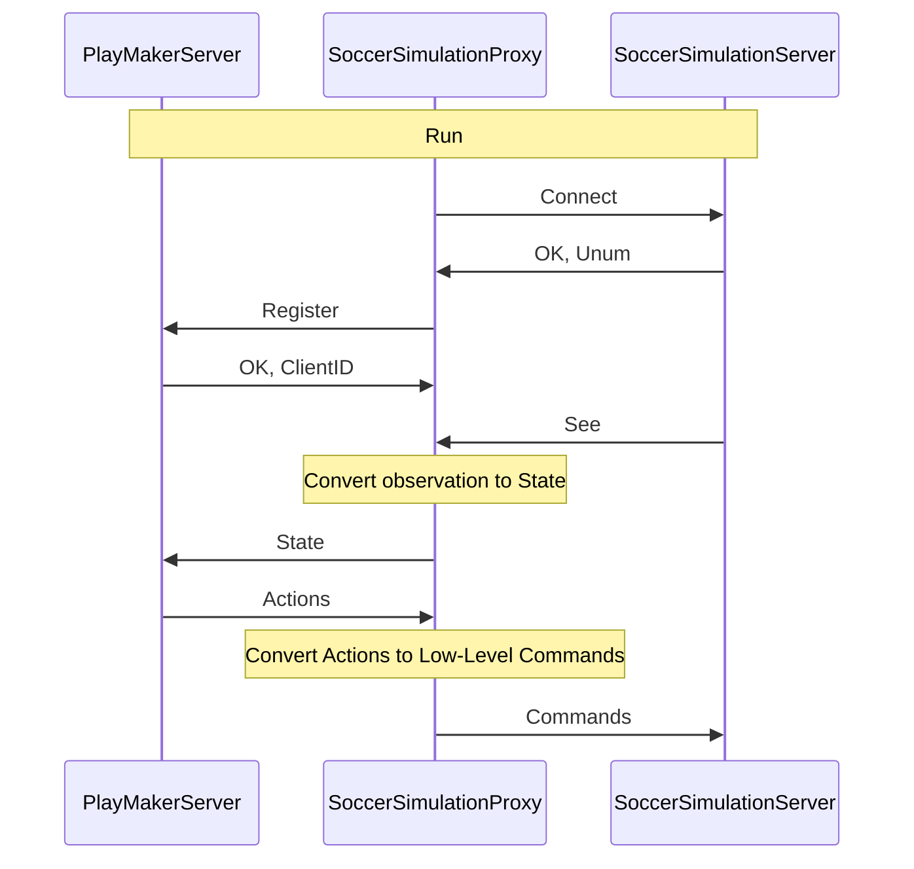

# Soccer Simulation Proxy

RoboCup is an international competition aimed at advancing autonomous robotics and AI through tasks like soccer and rescue. The RoboCup Soccer Simulation 2D league focuses on developing intelligent agents that play soccer in a simulated 2D environment. This league is ideal for testing and developing AI and ML algorithms, including reinforcement learning and multi-agent systems.

Soccer Simulation Proxy is a rpc client (gRPC or Thrift) that bridges the gap between the RoboCup Soccer Simulation 2D server and the PlayMaker Server. It receives information from the server, sends it to the PlayMaker Server, and sends the actions back to the server. This way, you can develop a team in any language supported by gRPC or Thrift, focusing on your team's strategy and AI algorithms without worrying about the server's complexity.

To run a game in the RoboCup Soccer Simulation 2D, you need to operate the rcssserver for hosting games, rcssmonitor to display them, and engage 12 agents (11 players and a coach) per team. Each cycle, agents receive data from the server and must execute actions such as dash and kick. Developing a team can be complex due to the environment's intricacy, typically necessitating C++ programming. However, our framework allows for other languages development, leveraging the helios-base features. By using Soccer Simulation Proxy, you can develop a team in any language supported by `gRPC` or `Thrift`, such as C#, C++, Dart, Go, Java, Kotlin, Node, Objective-C, PHP, Python, and Ruby. You just need to develop a gRPC server based on proto messages or a thrift server based on the thrift file to receive data (state) from the Soccer Simulation Proxy and send actions back to it. This way, you can focus on developing your team's strategy and AI algorithms without worrying about the server's complexity.

If you would like to develop a team or research in this area by using Python, C# or JavaScript you can check the following links:

- [Soccer Simulation Proxy](https://github.com/CLSFramework/soccer-simulation-proxy)
- [PlaymakerServer-CSharp](https://github.com/CLSFramework/playmaker-server-csharp)
- [PlaymakerServer-Python](https://github.com/CLSFramework/playmaker-server-python)
  - [Sample-PlaymakerServer-Python-GRPC](https://github.com/CLSFramework/sample-playmaker-server-python-grpc)
  - [Sample-PlaymakerServer-Python-THRIFT](https://github.com/CLSFramework/sample-playmaker-server-python-thrift)
  - [Starter-PlaymakerServer-Python-THRIFT](https://github.com/CLSFramework/starter-playmaker-server-python-thrift)
- [PlaymakerServer-NodeJs](https://github.com/CLSFramework/playmaker-server-nodejs)

This new base code is powered by Helios-Base code and gRPC to help researcher developing a soccer simulation 2D team or researching in this area by using any languages supported by gRPC and Thrift.

## Work Flow

## How To Use it?

To use this framework, you need to run rcssserver to host a game, run SoccerSimulationProxy (Agents) to connect to the rcssserver to receive information and send actions, and run Playmaker-Server (gRPC or Thrift-Server) to receive information from agents and send appropriate actions back. To watch the game, you can run rcssmonitor or SoccerWindow2.

To run the rcssserver and rcssmonitor, you can follow the instructions in the RcssServer page and RcssMonitor page.

To run the SoccerSimulationProxy, there are some different ways such as using Docker, building from source, or using AppImage.

We suggest you to use the AppImage to run the SoccerSimulationProxy. Check Soccer Simulation Proxy - AppImage page to download and run the AppImage.
