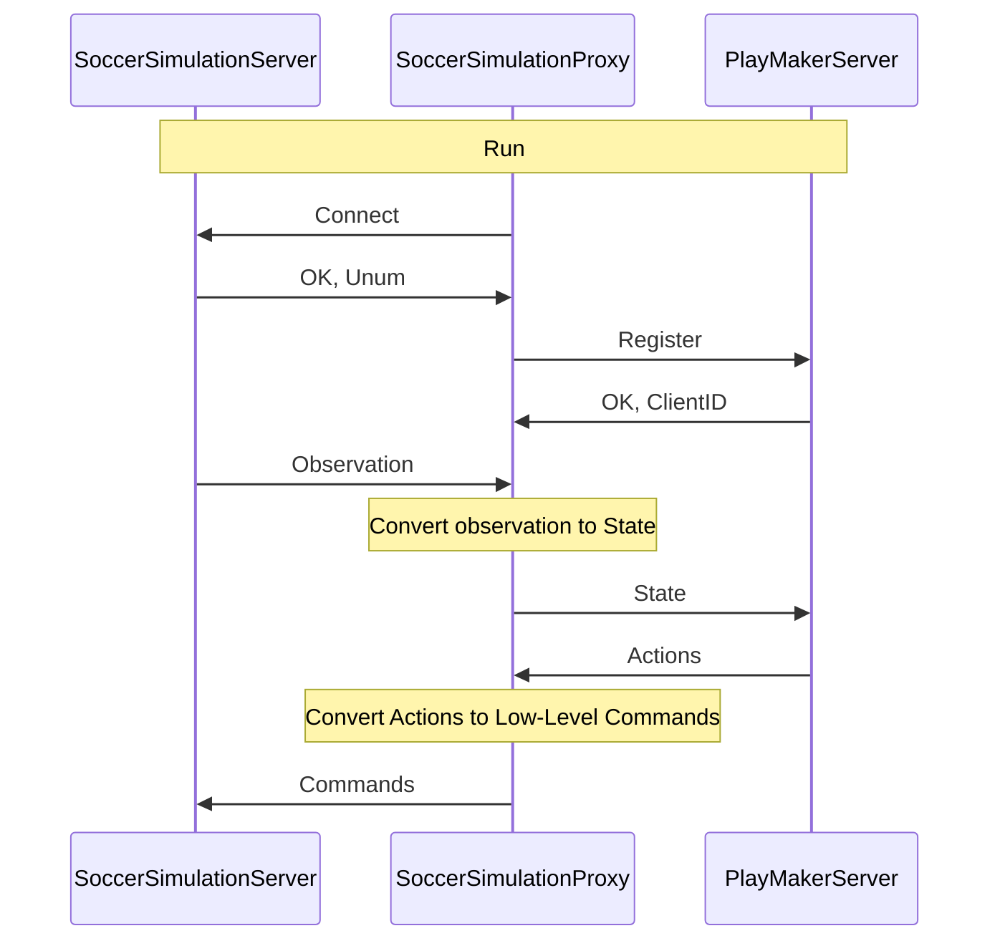

# Introduction

## RoboCup and Soccer Simulation 2D

RoboCup is an international robotics competition that focuses on promoting research and development in the field of autonomous robots. The competition aims to advance the state of the art in robotics and artificial intelligence by challenging teams to develop robots capable of playing soccer, rescue, and other tasks against other teams in a real-world or simulated environment.

RoboCup Soccer Simulation 2D is a league in the RoboCup competition that focuses on developing autonomous soccer-playing agents. The goal of the league is to develop intelligent agents that can play soccer in a simulated environment. The agents must be able to perceive the game state, make decisions based on that information, and execute actions to play the game effectively.

## Cross Language Soccer Framework

Cross Language Soccer Framework (CLSFramework) is a new approach to enhance the flexibility and interoperability of RoboCup Soccer Simulation 2D (SS2D). 
This framework is designed to allow the development of RoboCup Soccer Simulation 2D agents in different programming languages.
The Soccer Simulation Proxy is an extended version of the Helios base that can send decision-making information to a PlayMaker Server. It can receive high-level/low-level actions from the PlayMaker Server and send them to the RoboCup Soccer Simulation Server and/or SoccerWindow2.
On the other hand, the PlayMaker Server receives information from the client(Modified version of Helios base/Soccer Simulation Proxy) and selects the appropriate actions to be sent back to the client. We have implemented some sample servers in C\#, Python, and JavaScript, but it can also be implemented in other languages to make use of their features.

## How To Use The Framework?

To run a normal soccer simulation 2D game without using the proxy, you need to run the Soccer Simulation Server (RCSSServer) and the Soccer Simulator Monitor (RCSSMonitor). The Soccer Simulation Server will host the game, and the Soccer Simulator Monitor will display the game. Also, you need to run two teams to play the game. Each team should have a coach and eleven players (and trainer for training proposes and controlling the server). All of the clients connect to the RCSSServer by using UDP to send action and receive information.

To run a game by using the framework, you need to run the Soccer Simulation Server to host a game, the Soccer Simulator Monitor, Soccer Simulation Proxy, and a Playmaker Server. We provide some different solution to build, install, and run these components on Linux(Ubuntu) [Build From Source, AppImage, Docker] and Windows[WSL, Docker]. Also, there are some solutions that you can run some of the components together.

There are three different solutions to use the framework:

- Use the implemented Sample PlayMaker Servers in C\#, Python, and JavaScript and implement the decision-making part.
  - [PlaymakerServer-Python](https://github.com/CLSFramework/playmaker-server-python)
    - [Sample-PlaymakerServer-Python-GRPC](https://github.com/CLSFramework/sample-playmaker-server-python-grpc)
    - [Sample-PlaymakerServer-Python-THRIFT](https://github.com/CLSFramework/sample-playmaker-server-python-thrift)
  - [PlaymakerServer-NodeJs-GRPC](https://github.com/CLSFramework/playmaker-server-nodejs)
  - [PlaymakerServer-CSharp-GRPC](https://github.com/CLSFramework/playmaker-server-csharp)
- Use the implemented base code and complete the decision-making part.
  - [Starter-PlaymakerServer-Python-THRIFT](https://github.com/CLSFramework/starter-playmaker-server-python-thrift)
- Implement a PlayMaker Server in your favorite language and use the Soccer Simulation Proxy to connect to the RCSSServer.
  - [Soccer Simulation Proxy](https://github.com/CLSFramework/soccer-simulation-proxy)

## Cpp base problems

The base code provided by the RoboCup Soccer Simulation 2D community is written in C++ and is very complex. It is difficult to understand and modify, and it is not easy to implement new features or algorithms. Learning C++ language and understanding the base code requires a lot of time and effort, which can be a barrier for new researchers and developers who want to work on the RoboCup Soccer Simulation 2D league. Also, C++ does not AI/ML libraries like Python, which makes it difficult to implement new algorithms and models.

## Why not develop a base code for each language?

Developing a base code for each language is a time-consuming task that requires a lot of effort. The RCSSServer sends noisy observations to players and receives low-level actions such as Dash, Turn, and Kick. Therefore, a sample base code should process the received information, denoise it, create a model, make a decision, convert high-level decisions like BodySmartKick and BodyGoToPoint to low-level actions, and send them to the RCSSServer. However, developing a base code for each language is a time-consuming task, and some languages may not have the high-performance capabilities of C++, which can perform all tasks within a cycle of 0.1 seconds.

To overcome these challenges, the CLSFramework can denoise information, create models, and send them to the PlayMaker-Server. The PlayMaker-Server can be developed in any language supported by gRPC and is responsible for making decisions and sending actions to the SoccerSimulationProxy, which then sends the actions to the RCSSServer. This approach simplifies the development process and allows for more efficient implementation of the required functionalities.

## Workflow

