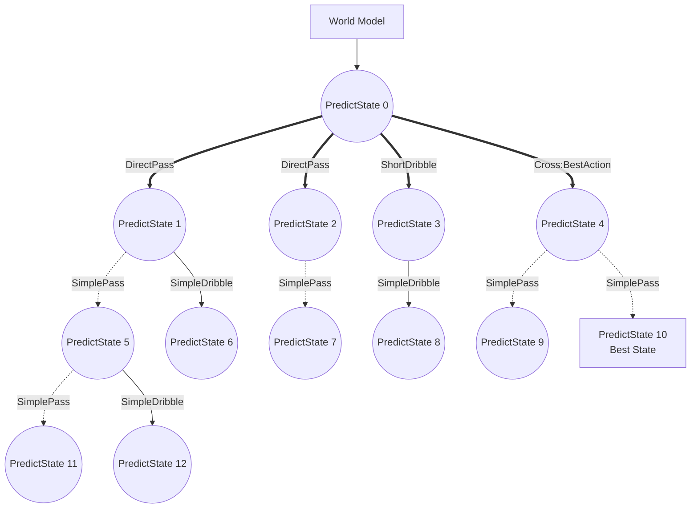
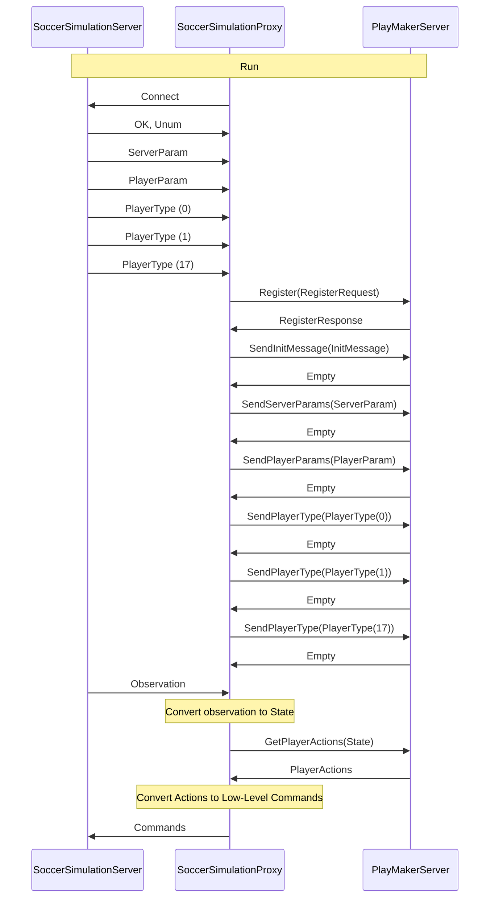

# Protocol Documentation
<a name="top"></a>


## Version: 1.9

## Table of Contents

- [idl/grpc/service.proto](#idl_grpc_service-proto)
    - [ActionTypeEffector](#protos-ActionTypeEffector)
    - [AddArc](#protos-AddArc)
    - [AddCircle](#protos-AddCircle)
    - [AddLine](#protos-AddLine)
    - [AddMessage](#protos-AddMessage)
    - [AddPoint](#protos-AddPoint)
    - [AddRectangle](#protos-AddRectangle)
    - [AddSector](#protos-AddSector)
    - [AddText](#protos-AddText)
    - [AddTriangle](#protos-AddTriangle)
    - [AttentionTo](#protos-AttentionTo)
    - [AttentionToOf](#protos-AttentionToOf)
    - [Ball](#protos-Ball)
    - [BallGoalieMessage](#protos-BallGoalieMessage)
    - [BallMessage](#protos-BallMessage)
    - [BallPlayerMessage](#protos-BallPlayerMessage)
    - [BestPlannerActionRequest](#protos-BestPlannerActionRequest)
    - [BestPlannerActionRequest.PairsEntry](#protos-BestPlannerActionRequest-PairsEntry)
    - [BestPlannerActionResponse](#protos-BestPlannerActionResponse)
    - [Bhv_BeforeKickOff](#protos-Bhv_BeforeKickOff)
    - [Bhv_BodyNeckToBall](#protos-Bhv_BodyNeckToBall)
    - [Bhv_BodyNeckToPoint](#protos-Bhv_BodyNeckToPoint)
    - [Bhv_Emergency](#protos-Bhv_Emergency)
    - [Bhv_GoToPointLookBall](#protos-Bhv_GoToPointLookBall)
    - [Bhv_NeckBodyToBall](#protos-Bhv_NeckBodyToBall)
    - [Bhv_NeckBodyToPoint](#protos-Bhv_NeckBodyToPoint)
    - [Bhv_ScanField](#protos-Bhv_ScanField)
    - [Body_AdvanceBall](#protos-Body_AdvanceBall)
    - [Body_ClearBall](#protos-Body_ClearBall)
    - [Body_Dribble](#protos-Body_Dribble)
    - [Body_GoToPoint](#protos-Body_GoToPoint)
    - [Body_GoToPointDodge](#protos-Body_GoToPointDodge)
    - [Body_HoldBall](#protos-Body_HoldBall)
    - [Body_Intercept](#protos-Body_Intercept)
    - [Body_KickOneStep](#protos-Body_KickOneStep)
    - [Body_SmartKick](#protos-Body_SmartKick)
    - [Body_StopBall](#protos-Body_StopBall)
    - [Body_StopDash](#protos-Body_StopDash)
    - [Body_TackleToPoint](#protos-Body_TackleToPoint)
    - [Body_TurnToAngle](#protos-Body_TurnToAngle)
    - [Body_TurnToBall](#protos-Body_TurnToBall)
    - [Body_TurnToPoint](#protos-Body_TurnToPoint)
    - [Catch](#protos-Catch)
    - [ChangePlayerType](#protos-ChangePlayerType)
    - [ChangeView](#protos-ChangeView)
    - [CoachAction](#protos-CoachAction)
    - [CoachActions](#protos-CoachActions)
    - [Dash](#protos-Dash)
    - [DebugClient](#protos-DebugClient)
    - [DefenseLineMessage](#protos-DefenseLineMessage)
    - [DoChangeMode](#protos-DoChangeMode)
    - [DoChangePlayerType](#protos-DoChangePlayerType)
    - [DoHeliosSayPlayerTypes](#protos-DoHeliosSayPlayerTypes)
    - [DoHeliosSubstitute](#protos-DoHeliosSubstitute)
    - [DoKickOff](#protos-DoKickOff)
    - [DoMoveBall](#protos-DoMoveBall)
    - [DoMovePlayer](#protos-DoMovePlayer)
    - [DoRecover](#protos-DoRecover)
    - [DribbleMessage](#protos-DribbleMessage)
    - [Empty](#protos-Empty)
    - [Focus_MoveToPoint](#protos-Focus_MoveToPoint)
    - [Focus_Reset](#protos-Focus_Reset)
    - [GoalieAndPlayerMessage](#protos-GoalieAndPlayerMessage)
    - [GoalieMessage](#protos-GoalieMessage)
    - [HeliosBasicMove](#protos-HeliosBasicMove)
    - [HeliosBasicOffensive](#protos-HeliosBasicOffensive)
    - [HeliosBasicTackle](#protos-HeliosBasicTackle)
    - [HeliosCommunicaion](#protos-HeliosCommunicaion)
    - [HeliosFieldEvaluator](#protos-HeliosFieldEvaluator)
    - [HeliosGoalie](#protos-HeliosGoalie)
    - [HeliosGoalieKick](#protos-HeliosGoalieKick)
    - [HeliosGoalieMove](#protos-HeliosGoalieMove)
    - [HeliosOffensivePlanner](#protos-HeliosOffensivePlanner)
    - [HeliosPenalty](#protos-HeliosPenalty)
    - [HeliosSetPlay](#protos-HeliosSetPlay)
    - [HeliosShoot](#protos-HeliosShoot)
    - [InitMessage](#protos-InitMessage)
    - [InterceptInfo](#protos-InterceptInfo)
    - [InterceptMessage](#protos-InterceptMessage)
    - [InterceptTable](#protos-InterceptTable)
    - [Kick](#protos-Kick)
    - [Log](#protos-Log)
    - [MatrixFieldEvaluator](#protos-MatrixFieldEvaluator)
    - [MatrixFieldEvaluatorY](#protos-MatrixFieldEvaluatorY)
    - [Move](#protos-Move)
    - [Neck_OffensiveInterceptNeck](#protos-Neck_OffensiveInterceptNeck)
    - [Neck_ScanField](#protos-Neck_ScanField)
    - [Neck_ScanPlayers](#protos-Neck_ScanPlayers)
    - [Neck_TurnToBall](#protos-Neck_TurnToBall)
    - [Neck_TurnToBallAndPlayer](#protos-Neck_TurnToBallAndPlayer)
    - [Neck_TurnToBallOrScan](#protos-Neck_TurnToBallOrScan)
    - [Neck_TurnToGoalieOrScan](#protos-Neck_TurnToGoalieOrScan)
    - [Neck_TurnToLowConfTeammate](#protos-Neck_TurnToLowConfTeammate)
    - [Neck_TurnToPlayerOrScan](#protos-Neck_TurnToPlayerOrScan)
    - [Neck_TurnToPoint](#protos-Neck_TurnToPoint)
    - [Neck_TurnToRelative](#protos-Neck_TurnToRelative)
    - [OffsideLineMessage](#protos-OffsideLineMessage)
    - [OnePlayerMessage](#protos-OnePlayerMessage)
    - [OpponentEffector](#protos-OpponentEffector)
    - [OpponentMessage](#protos-OpponentMessage)
    - [PassMessage](#protos-PassMessage)
    - [PassRequestMessage](#protos-PassRequestMessage)
    - [PenaltyKickState](#protos-PenaltyKickState)
    - [PlannerEvaluation](#protos-PlannerEvaluation)
    - [PlannerEvaluationEffector](#protos-PlannerEvaluationEffector)
    - [PlannerFieldEvaluator](#protos-PlannerFieldEvaluator)
    - [Player](#protos-Player)
    - [PlayerAction](#protos-PlayerAction)
    - [PlayerActions](#protos-PlayerActions)
    - [PlayerParam](#protos-PlayerParam)
    - [PlayerType](#protos-PlayerType)
    - [PointTo](#protos-PointTo)
    - [PointToOf](#protos-PointToOf)
    - [RecoveryMessage](#protos-RecoveryMessage)
    - [RegisterRequest](#protos-RegisterRequest)
    - [RegisterResponse](#protos-RegisterResponse)
    - [RpcActionState](#protos-RpcActionState)
    - [RpcCooperativeAction](#protos-RpcCooperativeAction)
    - [RpcPredictState](#protos-RpcPredictState)
    - [RpcVector2D](#protos-RpcVector2D)
    - [Say](#protos-Say)
    - [Self](#protos-Self)
    - [SelfMessage](#protos-SelfMessage)
    - [ServerParam](#protos-ServerParam)
    - [SetplayMessage](#protos-SetplayMessage)
    - [StaminaCapacityMessage](#protos-StaminaCapacityMessage)
    - [StaminaMessage](#protos-StaminaMessage)
    - [State](#protos-State)
    - [Tackle](#protos-Tackle)
    - [TeammateEffector](#protos-TeammateEffector)
    - [TeammateEffector.CoefficientsEntry](#protos-TeammateEffector-CoefficientsEntry)
    - [TeammateMessage](#protos-TeammateMessage)
    - [ThreePlayerMessage](#protos-ThreePlayerMessage)
    - [TrainerAction](#protos-TrainerAction)
    - [TrainerActions](#protos-TrainerActions)
    - [Turn](#protos-Turn)
    - [TurnNeck](#protos-TurnNeck)
    - [TwoPlayerMessage](#protos-TwoPlayerMessage)
    - [View_ChangeWidth](#protos-View_ChangeWidth)
    - [View_Normal](#protos-View_Normal)
    - [View_Synch](#protos-View_Synch)
    - [View_Wide](#protos-View_Wide)
    - [WaitRequestMessage](#protos-WaitRequestMessage)
    - [WorldModel](#protos-WorldModel)
    - [WorldModel.HeliosHomePositionsEntry](#protos-WorldModel-HeliosHomePositionsEntry)
    - [WorldModel.OurPlayersDictEntry](#protos-WorldModel-OurPlayersDictEntry)
    - [WorldModel.TheirPlayersDictEntry](#protos-WorldModel-TheirPlayersDictEntry)
    - [bhv_doForceKick](#protos-bhv_doForceKick)
    - [bhv_doHeardPassRecieve](#protos-bhv_doHeardPassRecieve)
    - [bhv_goalieFreeKick](#protos-bhv_goalieFreeKick)
  
    - [AgentType](#protos-AgentType)
    - [CardType](#protos-CardType)
    - [GameModeType](#protos-GameModeType)
    - [InterceptActionType](#protos-InterceptActionType)
    - [LoggerLevel](#protos-LoggerLevel)
    - [RpcActionCategory](#protos-RpcActionCategory)
    - [RpcServerLanguageType](#protos-RpcServerLanguageType)
    - [Side](#protos-Side)
    - [ViewWidth](#protos-ViewWidth)
  
    - [Game](#protos-Game)
  
- [Scalar Value Types](#scalar-value-types)


<a name="idl_grpc_service-proto"></a>
<p align="right"><a href="#top">Top</a></p>

## idl/grpc/service.proto


<a name="protos-ActionTypeEffector"></a>

### ActionTypeEffector
ActionTypeEffector is the message that represents coefficients of the action types in the tree to calculate the predicted state evaluation.
Each number should start from 0.0. For example, if evaluation of an action-state is 10, the action is direct pass, and value of direct_pass is 0.5, so the final evaluation of the action-state will be 5.
example in python grpc:
```python
actions = []
action_type_effector = pb2.ActionTypeEffector(
direct_pass=2.0,
lead_pass=1.5,
through_pass=1.0,
short_dribble=1.0,
long_dribble=1.0,
cross=1.0,
hold=1.0
)
planner_evaluation_effector = pb2.PlannerEvaluationEffector(
# opponent_effector= ...
# teammate_effector= ...
action_type_effector= action_type_effector
)
planner_evaluation = pb2.PlannerEvaluation(
effectors=planner_evaluation_effector,
)
helios_offensive_planner = pb2.HeliosOffensivePlanner(
lead_pass=True,
direct_pass=False,
through_pass=True,
simple_pass=True,
short_dribble=True,
long_dribble=True,
simple_shoot=True,
simple_dribble=False,
cross=True,
server_side_decision=False,
max_depth=5,
max_nodes=800,
evalution=planner_evaluation
)
actions.append(pb2.PlayerAction(helios_offensive_planner=helios_offensive_planner))
return pb2.PlayerActions(actions=actions)
```


| Field | Type | Label | Description |
| ----- | ---- | ----- | ----------- |
| direct_pass | [float](#float) |  | The coefficient of the direct pass action. |
| lead_pass | [float](#float) |  | The coefficient of the lead pass action. |
| through_pass | [float](#float) |  | The coefficient of the through pass action. |
| short_dribble | [float](#float) |  | The coefficient of the short dribble action. |
| long_dribble | [float](#float) |  | The coefficient of the long dribble action. |
| cross | [float](#float) |  | The coefficient of the cross action. |
| hold | [float](#float) |  | The coefficient of the hold action. |


<a name="protos-AddArc"></a>

### AddArc


| Field | Type | Label | Description |
| ----- | ---- | ----- | ----------- |
| level | [LoggerLevel](#protos-LoggerLevel) |  |  |
| center | [RpcVector2D](#protos-RpcVector2D) |  |  |
| radius | [float](#float) |  |  |
| start_angle | [float](#float) |  |  |
| span_angel | [float](#float) |  |  |
| color | [string](#string) |  |  |


<a name="protos-AddCircle"></a>

### AddCircle


| Field | Type | Label | Description |
| ----- | ---- | ----- | ----------- |
| level | [LoggerLevel](#protos-LoggerLevel) |  |  |
| center | [RpcVector2D](#protos-RpcVector2D) |  |  |
| radius | [float](#float) |  |  |
| color | [string](#string) |  |  |
| fill | [bool](#bool) |  |  |


<a name="protos-AddLine"></a>

### AddLine


| Field | Type | Label | Description |
| ----- | ---- | ----- | ----------- |
| level | [LoggerLevel](#protos-LoggerLevel) |  |  |
| start | [RpcVector2D](#protos-RpcVector2D) |  |  |
| end | [RpcVector2D](#protos-RpcVector2D) |  |  |
| color | [string](#string) |  |  |


<a name="protos-AddMessage"></a>

### AddMessage


| Field | Type | Label | Description |
| ----- | ---- | ----- | ----------- |
| level | [LoggerLevel](#protos-LoggerLevel) |  |  |
| position | [RpcVector2D](#protos-RpcVector2D) |  |  |
| message | [string](#string) |  |  |
| color | [string](#string) |  |  |


<a name="protos-AddPoint"></a>

### AddPoint


| Field | Type | Label | Description |
| ----- | ---- | ----- | ----------- |
| level | [LoggerLevel](#protos-LoggerLevel) |  |  |
| point | [RpcVector2D](#protos-RpcVector2D) |  |  |
| color | [string](#string) |  |  |


<a name="protos-AddRectangle"></a>

### AddRectangle


| Field | Type | Label | Description |
| ----- | ---- | ----- | ----------- |
| level | [LoggerLevel](#protos-LoggerLevel) |  |  |
| left | [float](#float) |  |  |
| top | [float](#float) |  |  |
| length | [float](#float) |  |  |
| width | [float](#float) |  |  |
| color | [string](#string) |  |  |
| fill | [bool](#bool) |  |  |


<a name="protos-AddSector"></a>

### AddSector


| Field | Type | Label | Description |
| ----- | ---- | ----- | ----------- |
| level | [LoggerLevel](#protos-LoggerLevel) |  |  |
| center | [RpcVector2D](#protos-RpcVector2D) |  |  |
| min_radius | [float](#float) |  |  |
| max_radius | [float](#float) |  |  |
| start_angle | [float](#float) |  |  |
| span_angel | [float](#float) |  |  |
| color | [string](#string) |  |  |
| fill | [bool](#bool) |  |  |


<a name="protos-AddText"></a>

### AddText


| Field | Type | Label | Description |
| ----- | ---- | ----- | ----------- |
| level | [LoggerLevel](#protos-LoggerLevel) |  |  |
| message | [string](#string) |  |  |


<a name="protos-AddTriangle"></a>

### AddTriangle


| Field | Type | Label | Description |
| ----- | ---- | ----- | ----------- |
| level | [LoggerLevel](#protos-LoggerLevel) |  |  |
| point1 | [RpcVector2D](#protos-RpcVector2D) |  |  |
| point2 | [RpcVector2D](#protos-RpcVector2D) |  |  |
| point3 | [RpcVector2D](#protos-RpcVector2D) |  |  |
| color | [string](#string) |  |  |
| fill | [bool](#bool) |  |  |


<a name="protos-AttentionTo"></a>

### AttentionTo


| Field | Type | Label | Description |
| ----- | ---- | ----- | ----------- |
| side | [Side](#protos-Side) |  |  |
| unum | [int32](#int32) |  |  |


<a name="protos-AttentionToOf"></a>

### AttentionToOf


<a name="protos-Ball"></a>

### Ball
Ball is the message that represents the ball in the soccer simulation.


| Field | Type | Label | Description |
| ----- | ---- | ----- | ----------- |
| position | [RpcVector2D](#protos-RpcVector2D) |  | The position of the ball. |
| relative_position | [RpcVector2D](#protos-RpcVector2D) |  | The relative position of the ball to the agent who is sending the message. |
| seen_position | [RpcVector2D](#protos-RpcVector2D) |  | The position of the ball that the agent has seen. |
| heard_position | [RpcVector2D](#protos-RpcVector2D) |  | The position of the ball that the agent has heard. |
| velocity | [RpcVector2D](#protos-RpcVector2D) |  | The velocity of the ball. |
| seen_velocity | [RpcVector2D](#protos-RpcVector2D) |  | The velocity of the ball that the agent has seen. |
| heard_velocity | [RpcVector2D](#protos-RpcVector2D) |  | The velocity of the ball that the agent has heard. |
| pos_count | [int32](#int32) |  | How many cycles ago the agent has seen or heard the ball. |
| seen_pos_count | [int32](#int32) |  | How many cycles ago the agent has seen the ball. |
| heard_pos_count | [int32](#int32) |  | How many cycles ago the agent has heard the ball. |
| vel_count | [int32](#int32) |  | How many cycles ago the agent has seen or heard the velocity of the ball. |
| seen_vel_count | [int32](#int32) |  | How many cycles ago the agent has seen the velocity of the ball. |
| heard_vel_count | [int32](#int32) |  | How many cycles ago the agent has heard the velocity of the ball. |
| lost_count | [int32](#int32) |  | How many cycles ago the agent has lost the ball. |
| ghost_count | [int32](#int32) |  |  |
| dist_from_self | [float](#float) |  | The distance of the ball from the agent who is sending the message. |
| angle_from_self | [float](#float) |  | The angle of the ball from the agent who is sending the message. |


<a name="protos-BallGoalieMessage"></a>

### BallGoalieMessage


| Field | Type | Label | Description |
| ----- | ---- | ----- | ----------- |
| ball_position | [RpcVector2D](#protos-RpcVector2D) |  |  |
| ball_velocity | [RpcVector2D](#protos-RpcVector2D) |  |  |
| goalie_position | [RpcVector2D](#protos-RpcVector2D) |  |  |
| goalie_body_direction | [float](#float) |  |  |


<a name="protos-BallMessage"></a>

### BallMessage


| Field | Type | Label | Description |
| ----- | ---- | ----- | ----------- |
| ball_position | [RpcVector2D](#protos-RpcVector2D) |  |  |
| ball_velocity | [RpcVector2D](#protos-RpcVector2D) |  |  |


<a name="protos-BallPlayerMessage"></a>

### BallPlayerMessage


| Field | Type | Label | Description |
| ----- | ---- | ----- | ----------- |
| ball_position | [RpcVector2D](#protos-RpcVector2D) |  |  |
| ball_velocity | [RpcVector2D](#protos-RpcVector2D) |  |  |
| uniform_number | [int32](#int32) |  |  |
| player_position | [RpcVector2D](#protos-RpcVector2D) |  |  |
| body_direction | [float](#float) |  |  |


<a name="protos-BestPlannerActionRequest"></a>

### BestPlannerActionRequest


| Field | Type | Label | Description |
| ----- | ---- | ----- | ----------- |
| register_response | [RegisterResponse](#protos-RegisterResponse) |  |  |
| pairs | [BestPlannerActionRequest.PairsEntry](#protos-BestPlannerActionRequest-PairsEntry) | repeated |  |
| state | [State](#protos-State) |  |  |


<a name="protos-BestPlannerActionRequest-PairsEntry"></a>

### BestPlannerActionRequest.PairsEntry


| Field | Type | Label | Description |
| ----- | ---- | ----- | ----------- |
| key | [int32](#int32) |  |  |
| value | [RpcActionState](#protos-RpcActionState) |  |  |


<a name="protos-BestPlannerActionResponse"></a>

### BestPlannerActionResponse


| Field | Type | Label | Description |
| ----- | ---- | ----- | ----------- |
| index | [int32](#int32) |  |  |


<a name="protos-Bhv_BeforeKickOff"></a>

### Bhv_BeforeKickOff


| Field | Type | Label | Description |
| ----- | ---- | ----- | ----------- |
| point | [RpcVector2D](#protos-RpcVector2D) |  |  |


<a name="protos-Bhv_BodyNeckToBall"></a>

### Bhv_BodyNeckToBall


<a name="protos-Bhv_BodyNeckToPoint"></a>

### Bhv_BodyNeckToPoint


| Field | Type | Label | Description |
| ----- | ---- | ----- | ----------- |
| point | [RpcVector2D](#protos-RpcVector2D) |  |  |


<a name="protos-Bhv_Emergency"></a>

### Bhv_Emergency


<a name="protos-Bhv_GoToPointLookBall"></a>

### Bhv_GoToPointLookBall


| Field | Type | Label | Description |
| ----- | ---- | ----- | ----------- |
| target_point | [RpcVector2D](#protos-RpcVector2D) |  |  |
| distance_threshold | [float](#float) |  |  |
| max_dash_power | [float](#float) |  |  |


<a name="protos-Bhv_NeckBodyToBall"></a>

### Bhv_NeckBodyToBall


| Field | Type | Label | Description |
| ----- | ---- | ----- | ----------- |
| angle_buf | [float](#float) |  |  |


<a name="protos-Bhv_NeckBodyToPoint"></a>

### Bhv_NeckBodyToPoint


| Field | Type | Label | Description |
| ----- | ---- | ----- | ----------- |
| point | [RpcVector2D](#protos-RpcVector2D) |  |  |
| angle_buf | [float](#float) |  |  |


<a name="protos-Bhv_ScanField"></a>

### Bhv_ScanField


<a name="protos-Body_AdvanceBall"></a>

### Body_AdvanceBall


<a name="protos-Body_ClearBall"></a>

### Body_ClearBall


<a name="protos-Body_Dribble"></a>

### Body_Dribble


| Field | Type | Label | Description |
| ----- | ---- | ----- | ----------- |
| target_point | [RpcVector2D](#protos-RpcVector2D) |  |  |
| distance_threshold | [float](#float) |  |  |
| dash_power | [float](#float) |  |  |
| dash_count | [int32](#int32) |  |  |
| dodge | [bool](#bool) |  |  |


<a name="protos-Body_GoToPoint"></a>

### Body_GoToPoint
todo more variables


| Field | Type | Label | Description |
| ----- | ---- | ----- | ----------- |
| target_point | [RpcVector2D](#protos-RpcVector2D) |  |  |
| distance_threshold | [float](#float) |  |  |
| max_dash_power | [float](#float) |  |  |


<a name="protos-Body_GoToPointDodge"></a>

### Body_GoToPointDodge


| Field | Type | Label | Description |
| ----- | ---- | ----- | ----------- |
| target_point | [RpcVector2D](#protos-RpcVector2D) |  |  |
| dash_power | [float](#float) |  |  |


<a name="protos-Body_HoldBall"></a>

### Body_HoldBall


| Field | Type | Label | Description |
| ----- | ---- | ----- | ----------- |
| do_turn | [bool](#bool) |  |  |
| turn_target_point | [RpcVector2D](#protos-RpcVector2D) |  |  |
| kick_target_point | [RpcVector2D](#protos-RpcVector2D) |  |  |


<a name="protos-Body_Intercept"></a>

### Body_Intercept


| Field | Type | Label | Description |
| ----- | ---- | ----- | ----------- |
| save_recovery | [bool](#bool) |  |  |
| face_point | [RpcVector2D](#protos-RpcVector2D) |  |  |


<a name="protos-Body_KickOneStep"></a>

### Body_KickOneStep


| Field | Type | Label | Description |
| ----- | ---- | ----- | ----------- |
| target_point | [RpcVector2D](#protos-RpcVector2D) |  |  |
| first_speed | [float](#float) |  |  |
| force_mode | [bool](#bool) |  |  |


<a name="protos-Body_SmartKick"></a>

### Body_SmartKick
todo more variables


| Field | Type | Label | Description |
| ----- | ---- | ----- | ----------- |
| target_point | [RpcVector2D](#protos-RpcVector2D) |  |  |
| first_speed | [float](#float) |  |  |
| first_speed_threshold | [float](#float) |  |  |
| max_steps | [int32](#int32) |  |  |


<a name="protos-Body_StopBall"></a>

### Body_StopBall


<a name="protos-Body_StopDash"></a>

### Body_StopDash


| Field | Type | Label | Description |
| ----- | ---- | ----- | ----------- |
| save_recovery | [bool](#bool) |  |  |


<a name="protos-Body_TackleToPoint"></a>

### Body_TackleToPoint


| Field | Type | Label | Description |
| ----- | ---- | ----- | ----------- |
| target_point | [RpcVector2D](#protos-RpcVector2D) |  |  |
| min_probability | [float](#float) |  |  |
| min_speed | [float](#float) |  |  |


<a name="protos-Body_TurnToAngle"></a>

### Body_TurnToAngle


| Field | Type | Label | Description |
| ----- | ---- | ----- | ----------- |
| angle | [float](#float) |  |  |


<a name="protos-Body_TurnToBall"></a>

### Body_TurnToBall


| Field | Type | Label | Description |
| ----- | ---- | ----- | ----------- |
| cycle | [int32](#int32) |  |  |


<a name="protos-Body_TurnToPoint"></a>

### Body_TurnToPoint


| Field | Type | Label | Description |
| ----- | ---- | ----- | ----------- |
| target_point | [RpcVector2D](#protos-RpcVector2D) |  |  |
| cycle | [int32](#int32) |  |  |


<a name="protos-Catch"></a>

### Catch


<a name="protos-ChangePlayerType"></a>

### ChangePlayerType


| Field | Type | Label | Description |
| ----- | ---- | ----- | ----------- |
| uniform_number | [int32](#int32) |  |  |
| type | [int32](#int32) |  |  |


<a name="protos-ChangeView"></a>

### ChangeView


| Field | Type | Label | Description |
| ----- | ---- | ----- | ----------- |
| view_width | [ViewWidth](#protos-ViewWidth) |  |  |


<a name="protos-CoachAction"></a>

### CoachAction


| Field | Type | Label | Description |
| ----- | ---- | ----- | ----------- |
| change_player_types | [ChangePlayerType](#protos-ChangePlayerType) |  |  |
| do_helios_substitute | [DoHeliosSubstitute](#protos-DoHeliosSubstitute) |  |  |
| do_helios_say_player_types | [DoHeliosSayPlayerTypes](#protos-DoHeliosSayPlayerTypes) |  |  |


<a name="protos-CoachActions"></a>

### CoachActions


| Field | Type | Label | Description |
| ----- | ---- | ----- | ----------- |
| actions | [CoachAction](#protos-CoachAction) | repeated |  |


<a name="protos-Dash"></a>

### Dash
Dash is the message that represents the dash action in the soccer simulation.
By using this action, agent can dash (run or walk) to a direction with a power.
The rcssserver, calculates the next position and velocity of the agent based on current position, velocity, power and direction.


| Field | Type | Label | Description |
| ----- | ---- | ----- | ----------- |
| power | [float](#float) |  | The power of the dash action. The power can be between -100 to 100. If the power is negative, the agent will dash in the backward direction by using two times of the power. |
| relative_direction | [float](#float) |  | The relative direction of the dash action to the body direction of the agent. The direction can be between -180 to 180. |


<a name="protos-DebugClient"></a>

### DebugClient


| Field | Type | Label | Description |
| ----- | ---- | ----- | ----------- |
| message | [string](#string) |  |  |


<a name="protos-DefenseLineMessage"></a>

### DefenseLineMessage


| Field | Type | Label | Description |
| ----- | ---- | ----- | ----------- |
| defense_line_x | [float](#float) |  |  |


<a name="protos-DoChangeMode"></a>

### DoChangeMode


| Field | Type | Label | Description |
| ----- | ---- | ----- | ----------- |
| game_mode_type | [GameModeType](#protos-GameModeType) |  |  |
| side | [Side](#protos-Side) |  | some of the game mode need to know the side |


<a name="protos-DoChangePlayerType"></a>

### DoChangePlayerType


| Field | Type | Label | Description |
| ----- | ---- | ----- | ----------- |
| our_side | [bool](#bool) |  |  |
| uniform_number | [int32](#int32) |  |  |
| type | [int32](#int32) |  |  |


<a name="protos-DoHeliosSayPlayerTypes"></a>

### DoHeliosSayPlayerTypes


<a name="protos-DoHeliosSubstitute"></a>

### DoHeliosSubstitute


<a name="protos-DoKickOff"></a>

### DoKickOff


<a name="protos-DoMoveBall"></a>

### DoMoveBall


| Field | Type | Label | Description |
| ----- | ---- | ----- | ----------- |
| position | [RpcVector2D](#protos-RpcVector2D) |  |  |
| velocity | [RpcVector2D](#protos-RpcVector2D) |  |  |


<a name="protos-DoMovePlayer"></a>

### DoMovePlayer


| Field | Type | Label | Description |
| ----- | ---- | ----- | ----------- |
| our_side | [bool](#bool) |  |  |
| uniform_number | [int32](#int32) |  |  |
| position | [RpcVector2D](#protos-RpcVector2D) |  |  |
| body_direction | [float](#float) |  |  |


<a name="protos-DoRecover"></a>

### DoRecover


<a name="protos-DribbleMessage"></a>

### DribbleMessage


| Field | Type | Label | Description |
| ----- | ---- | ----- | ----------- |
| target_point | [RpcVector2D](#protos-RpcVector2D) |  |  |
| queue_count | [int32](#int32) |  |  |


<a name="protos-Empty"></a>

### Empty


<a name="protos-Focus_MoveToPoint"></a>

### Focus_MoveToPoint


| Field | Type | Label | Description |
| ----- | ---- | ----- | ----------- |
| target_point | [RpcVector2D](#protos-RpcVector2D) |  |  |


<a name="protos-Focus_Reset"></a>

### Focus_Reset


<a name="protos-GoalieAndPlayerMessage"></a>

### GoalieAndPlayerMessage


| Field | Type | Label | Description |
| ----- | ---- | ----- | ----------- |
| goalie_uniform_number | [int32](#int32) |  |  |
| goalie_position | [RpcVector2D](#protos-RpcVector2D) |  |  |
| goalie_body_direction | [float](#float) |  |  |
| player_uniform_number | [int32](#int32) |  |  |
| player_position | [RpcVector2D](#protos-RpcVector2D) |  |  |


<a name="protos-GoalieMessage"></a>

### GoalieMessage


| Field | Type | Label | Description |
| ----- | ---- | ----- | ----------- |
| goalie_uniform_number | [int32](#int32) |  |  |
| goalie_position | [RpcVector2D](#protos-RpcVector2D) |  |  |
| goalie_body_direction | [float](#float) |  |  |


<a name="protos-HeliosBasicMove"></a>

### HeliosBasicMove


<a name="protos-HeliosBasicOffensive"></a>

### HeliosBasicOffensive


<a name="protos-HeliosBasicTackle"></a>

### HeliosBasicTackle


| Field | Type | Label | Description |
| ----- | ---- | ----- | ----------- |
| min_prob | [float](#float) |  |  |
| body_thr | [float](#float) |  |  |


<a name="protos-HeliosCommunicaion"></a>

### HeliosCommunicaion


<a name="protos-HeliosFieldEvaluator"></a>

### HeliosFieldEvaluator
HeliosFieldEvaluator is the message that represents the field evaluator of the proxy agent to evaluate each node (predicted state) in the planner tree.
If you dont set the field evaluator, the proxy agent will use the default field evaluator (HeliosFieldEvaluator) to evaluate each node in the planner tree.
This field evaluator calculate the value of the predicted state by using this formula: 
value = x_coefficient * (ball.x &#43; 52.5) &#43; ball_dist_to_goal_coefficient * max(0.0, effective_max_ball_dist_to_goal - ball.dist(opponent goal center))
example in python grpc:
```python
actions = []
helios_field_evaluator = pb2.HeliosFieldEvaluator(
x_coefficient=2.1,
ball_dist_to_goal_coefficient=1.8,
effective_max_ball_dist_to_goal=50.0
)
field_evaluator = pb2.PlannerFieldEvaluator(
helios_field_evaluator=helios_field_evaluator,
# matrix_field_evaluator=...
)
planner_evaluation = pb2.PlannerEvaluation(
field_evaluators=field_evaluator
)
helios_offensive_planner = pb2.HeliosOffensivePlanner(
lead_pass=True,
direct_pass=False,
through_pass=True,
simple_pass=True,
short_dribble=True,
long_dribble=True,
simple_shoot=True,
simple_dribble=False,
cross=True,
server_side_decision=False,
max_depth=5,
max_nodes=800,
evalution=planner_evaluation
)
actions.append(pb2.PlayerAction(helios_offensive_planner=helios_offensive_planner))
return pb2.PlayerActions(actions=actions)
```


| Field | Type | Label | Description |
| ----- | ---- | ----- | ----------- |
| x_coefficient | [float](#float) |  | The coefficient of the x-coordinate of the ball in the predicted state. The default value is 1. |
| ball_dist_to_goal_coefficient | [float](#float) |  | The coefficient of the distance of the ball to the opponent goal center in the predicted state. The default value is 1. |
| effective_max_ball_dist_to_goal | [float](#float) |  | The effective maximum distance of the ball to the opponent goal center in the predicted state. The default value is 40.0. |


<a name="protos-HeliosGoalie"></a>

### HeliosGoalie


<a name="protos-HeliosGoalieKick"></a>

### HeliosGoalieKick


<a name="protos-HeliosGoalieMove"></a>

### HeliosGoalieMove


<a name="protos-HeliosOffensivePlanner"></a>

### HeliosOffensivePlanner
HeliosOffensivePlanner is the message that represents the offensive planner of the agent in the soccer simulation.
The offensive planner is responsible for making decisions about the offensive actions of the agent by creating a tree of actions, 
finding the best chain of actions, and executing the first action in the chain, when the agent is ball owner.
The best action is an action with best incomming predicted state.
The best predicted state is the state that has the best evaluation value by using this formula: value = ball.x &#43; max(0.0, 40.0 - ball.dist(opponent goal center))
Due to the complexity of the not simple actions, the agent can not calculate the best action in the first layer of the tree. So, the agent can use the simple actions in the first layer of the tree.
To create the tree, the planner create all possible edges (actions) and create the next state of the agent by using each action.
Then the planner starts to create the next layer of the tree by using the next state of the agent. The planner continues to create the tree until 
the max depth of the tree or number of edges is reached.
For more information check this paper: [HELIOS Base: An Open Source Package for the RoboCup Soccer 2D Simulation](https://link.springer.com/chapter/10.1007/978-3-662-44468-9_46)

Creating the tree and find best predicted state and action:




| Field | Type | Label | Description |
| ----- | ---- | ----- | ----------- |
| direct_pass | [bool](#bool) |  | Whether the agent can make a direct pass or not. The direct pass is a pass action that the agent can pass the ball to the position of a teammate player. This action is just used in the first layer of the tree. |
| lead_pass | [bool](#bool) |  | Whether the agent can make a lead pass or not. The lead pass is a pass action that the agent can pass the ball to the position of a teammate player with a lead (very cloase to the teammate). This action is just used in the first layer of the tree. |
| through_pass | [bool](#bool) |  | Whether the agent can make a through pass or not. The through pass is a pass action that the agent can pass the ball to the position of a teammate player with a through (close or very far from the teammate, between teammates and opponent goal). This action is just used in the first layer of the tree. |
| short_dribble | [bool](#bool) |  | Whether the agent can make a short dribble or not. The short dribble is a dribble action that the agent can dribble the ball to a position. This action is just used in the first layer of the tree. |
| long_dribble | [bool](#bool) |  | Whether the agent can make a long dribble or not. The long dribble is a dribble action that the agent can dribble the ball to a position. This dribble is longer than the short dribble. This action is just used in the first layer of the tree |
| cross | [bool](#bool) |  | Whether the agent can make a cross or not. The cross is a kick action that the agent can kick the ball to the position close to teammate, but it does not care that the teammate can control the ball or not. This action is just used in the first layer of the tree. |
| simple_pass | [bool](#bool) |  | Whether the agent can make a simple pass or not. The simple pass is a pass action that the agent can pass the ball to the position of a teammate player. This action is just used in the second or more layers of the tree. This action is not very accurate. |
| simple_dribble | [bool](#bool) |  | Whether the agent can make a simple dribble or not. The simple dribble is a dribble action that the agent can dribble the ball to a position. This action is just used in the second or more layers of the tree. This action is not very accurate. |
| simple_shoot | [bool](#bool) |  | Whether the agent can make a simple shoot or not. The simple shoot is a kick action that the agent can kick the ball to the opponent goal. This action is just used in the second or more layers of the tree. This action is not very accurate. |
| server_side_decision | [bool](#bool) |  | If this value is true, the proxy agent, will create the tree and send all of the nodes to the playmaker server to choose the best action. If this value is false, the proxy agent will choose the best action by itself. The default value is false. |
| max_depth | [int32](#int32) |  | The maximum depth of the tree. The agent will create the tree with this depth. To create the first layer of the tree, the agent will use the direct_pass, lead_pass, through_pass, short_dribble, long_dribble, cross actions. The difault value is 4. So, if you do not set this value, the agent will create the tree with 4 depth. Due to the default value of rpc, 0 means the default value. |
| max_nodes | [int32](#int32) |  | The maximum number of nodes in the tree. The agent will create the tree with this number of nodes. The difault value is 500. So, if you do not set this value, the agent will create the tree with 500 nodes. Due to the default value of rpc, 0 means the default value. |
| evaluation | [PlannerEvaluation](#protos-PlannerEvaluation) |  | The evaluation methods to evaluate the actions[predicted states] in the tree. |


<a name="protos-HeliosPenalty"></a>

### HeliosPenalty


<a name="protos-HeliosSetPlay"></a>

### HeliosSetPlay


<a name="protos-HeliosShoot"></a>

### HeliosShoot


<a name="protos-InitMessage"></a>

### InitMessage


| Field | Type | Label | Description |
| ----- | ---- | ----- | ----------- |
| register_response | [RegisterResponse](#protos-RegisterResponse) |  |  |
| debug_mode | [bool](#bool) |  |  |


<a name="protos-InterceptInfo"></a>

### InterceptInfo
InterceptInfo is the message that represents the information about an intercept action.


| Field | Type | Label | Description |
| ----- | ---- | ----- | ----------- |
| action_type | [InterceptActionType](#protos-InterceptActionType) |  | The type of the intercept action. |
| turn_steps | [int32](#int32) |  | The number of steps that the agent needs to turn to the ball. |
| turn_angle | [float](#float) |  | The angle that the agent needs to turn to the ball. |
| dash_steps | [int32](#int32) |  | The number of steps that the agent needs to dash to the ball. |
| dash_power | [float](#float) |  | The power of the dash action. |
| dash_dir | [float](#float) |  | The direction of the dash action to player&#39;s body direction. |
| final_self_position | [RpcVector2D](#protos-RpcVector2D) |  | The final position of the agent after the intercept action. |
| final_ball_dist | [float](#float) |  | The final distance of the ball from the agent after the intercept action. |
| final_stamina | [float](#float) |  | The final stamina of the agent after the intercept action. |
| value | [float](#float) |  | The value of the intercept action. TODO less is better or more is better? |


<a name="protos-InterceptMessage"></a>

### InterceptMessage


| Field | Type | Label | Description |
| ----- | ---- | ----- | ----------- |
| our | [bool](#bool) |  |  |
| uniform_number | [int32](#int32) |  |  |
| cycle | [int32](#int32) |  |  |


<a name="protos-InterceptTable"></a>

### InterceptTable
InterceptTable is the message that represents the intercept table of the agent.


| Field | Type | Label | Description |
| ----- | ---- | ----- | ----------- |
| self_reach_steps | [int32](#int32) |  | The number of steps that the agent needs to reach the ball. |
| first_teammate_reach_steps | [int32](#int32) |  | The number of steps that the first teammate needs to reach the ball. |
| second_teammate_reach_steps | [int32](#int32) |  | The number of steps that the second teammate needs to reach the ball. |
| first_opponent_reach_steps | [int32](#int32) |  | The number of steps that the first opponent needs to reach the ball. |
| second_opponent_reach_steps | [int32](#int32) |  | The number of steps that the second opponent needs to reach the ball. |
| first_teammate_id | [int32](#int32) |  | The ID of the first teammate. This ID is unique for each player&#39;s object in the each agent proxy. If the ID is 0, it means the agent has no first teammate. |
| second_teammate_id | [int32](#int32) |  | The ID of the second teammate. This ID is unique for each player&#39;s object in the each agent proxy. If the ID is 0, it means the agent has no second teammate. |
| first_opponent_id | [int32](#int32) |  | The ID of the first opponent. This ID is unique for each player&#39;s object in the each agent proxy. If the ID is 0, it means the agent has no first opponent. |
| second_opponent_id | [int32](#int32) |  | The ID of the second opponent. This ID is unique for each player&#39;s object in the each agent proxy. If the ID is 0, it means the agent has no second opponent. |
| self_intercept_info | [InterceptInfo](#protos-InterceptInfo) | repeated | The intercept information of the agent. |


<a name="protos-Kick"></a>

### Kick


| Field | Type | Label | Description |
| ----- | ---- | ----- | ----------- |
| power | [float](#float) |  |  |
| relative_direction | [float](#float) |  |  |


<a name="protos-Log"></a>

### Log


| Field | Type | Label | Description |
| ----- | ---- | ----- | ----------- |
| add_text | [AddText](#protos-AddText) |  |  |
| add_point | [AddPoint](#protos-AddPoint) |  |  |
| add_line | [AddLine](#protos-AddLine) |  |  |
| add_arc | [AddArc](#protos-AddArc) |  |  |
| add_circle | [AddCircle](#protos-AddCircle) |  |  |
| add_triangle | [AddTriangle](#protos-AddTriangle) |  |  |
| add_rectangle | [AddRectangle](#protos-AddRectangle) |  |  |
| add_sector | [AddSector](#protos-AddSector) |  |  |
| add_message | [AddMessage](#protos-AddMessage) |  |  |


<a name="protos-MatrixFieldEvaluator"></a>

### MatrixFieldEvaluator
MatrixFieldEvaluator is the message that represents the matrix field evaluator of the proxy agent to evaluate each node (predicted state) in the planner tree.
If you dont set the field evaluator, the proxy agent will use the default field evaluator (HeliosFieldEvaluator) to evaluate each node in the planner tree.
This field evaluator calculate the value of the predicted state by using a matrix of float values.
---------------------
| 10 | 20 | 30 | 40 | 
| 15 | 25 | 35 | 45 |
| 10 | 20 | 30 | 40 |
---------------------
In this example matrix, the value of each point in the opponent pernaly area is 45.
example in python grpc:
```python
actions = []
matrix_field_evaluator = pb2.MatrixFieldEvaluator(
evals=[
pb2.MatrixFieldEvaluatorY(evals=[10, 15, 10]),
pb2.MatrixFieldEvaluatorY(evals=[20, 25, 20]),
pb2.MatrixFieldEvaluatorY(evals=[30, 35, 30]),
pb2.MatrixFieldEvaluatorY(evals=[40, 45, 40]),
]
)
field_evaluator = pb2.PlannerFieldEvaluator(
# helios_field_evaluator=...
matrix_field_evaluator=matrix_field_evaluator
)
planner_evaluation = pb2.PlannerEvaluation(
field_evaluators=field_evaluator
)
helios_offensive_planner = pb2.HeliosOffensivePlanner(
lead_pass=True,
direct_pass=False,
through_pass=True,
simple_pass=True,
short_dribble=True,
long_dribble=True,
simple_shoot=True,
simple_dribble=False,
cross=True,
server_side_decision=False,
max_depth=5,
max_nodes=800,
evalution=planner_evaluation
)
actions.append(pb2.PlayerAction(helios_offensive_planner=helios_offensive_planner))
return pb2.PlayerActions(actions=actions)
```


| Field | Type | Label | Description |
| ----- | ---- | ----- | ----------- |
| evals | [MatrixFieldEvaluatorY](#protos-MatrixFieldEvaluatorY) | repeated |  |


<a name="protos-MatrixFieldEvaluatorY"></a>

### MatrixFieldEvaluatorY


| Field | Type | Label | Description |
| ----- | ---- | ----- | ----------- |
| evals | [float](#float) | repeated |  |


<a name="protos-Move"></a>

### Move


| Field | Type | Label | Description |
| ----- | ---- | ----- | ----------- |
| x | [float](#float) |  |  |
| y | [float](#float) |  |  |


<a name="protos-Neck_OffensiveInterceptNeck"></a>

### Neck_OffensiveInterceptNeck


<a name="protos-Neck_ScanField"></a>

### Neck_ScanField


<a name="protos-Neck_ScanPlayers"></a>

### Neck_ScanPlayers
todo min/max_angle


<a name="protos-Neck_TurnToBall"></a>

### Neck_TurnToBall


<a name="protos-Neck_TurnToBallAndPlayer"></a>

### Neck_TurnToBallAndPlayer


| Field | Type | Label | Description |
| ----- | ---- | ----- | ----------- |
| side | [Side](#protos-Side) |  |  |
| uniform_number | [int32](#int32) |  |  |
| count_threshold | [int32](#int32) |  |  |


<a name="protos-Neck_TurnToBallOrScan"></a>

### Neck_TurnToBallOrScan


| Field | Type | Label | Description |
| ----- | ---- | ----- | ----------- |
| count_threshold | [int32](#int32) |  |  |


<a name="protos-Neck_TurnToGoalieOrScan"></a>

### Neck_TurnToGoalieOrScan


| Field | Type | Label | Description |
| ----- | ---- | ----- | ----------- |
| count_threshold | [int32](#int32) |  |  |


<a name="protos-Neck_TurnToLowConfTeammate"></a>

### Neck_TurnToLowConfTeammate


<a name="protos-Neck_TurnToPlayerOrScan"></a>

### Neck_TurnToPlayerOrScan


| Field | Type | Label | Description |
| ----- | ---- | ----- | ----------- |
| side | [Side](#protos-Side) |  |  |
| uniform_number | [int32](#int32) |  |  |
| count_threshold | [int32](#int32) |  |  |


<a name="protos-Neck_TurnToPoint"></a>

### Neck_TurnToPoint


| Field | Type | Label | Description |
| ----- | ---- | ----- | ----------- |
| target_point | [RpcVector2D](#protos-RpcVector2D) |  |  |


<a name="protos-Neck_TurnToRelative"></a>

### Neck_TurnToRelative


| Field | Type | Label | Description |
| ----- | ---- | ----- | ----------- |
| angle | [float](#float) |  |  |


<a name="protos-OffsideLineMessage"></a>

### OffsideLineMessage


| Field | Type | Label | Description |
| ----- | ---- | ----- | ----------- |
| offside_line_x | [float](#float) |  |  |


<a name="protos-OnePlayerMessage"></a>

### OnePlayerMessage


| Field | Type | Label | Description |
| ----- | ---- | ----- | ----------- |
| uniform_number | [int32](#int32) |  |  |
| position | [RpcVector2D](#protos-RpcVector2D) |  |  |


<a name="protos-OpponentEffector"></a>

### OpponentEffector
PlannerEvaluation is the message that represents the evaluation methods to evaluate the actions[predicted states] in the tree.
Using this method causes the predicted state eval to be decreased based on the distance or reach steps of the opponent players to the position of the ball in the predicted state.
Each variable in the message is a list of float values.
For example, if you want to decrease the predicted state eval if the distance of the opponent player to the ball is less than 5,
You can set the negetive_effect_by_distance variable with the value of [-9.0, -8.5, -7.2, -6.1, -3.8]. It means the predicted state eval will be decreased by 9.0 if the distance is less than 1,
8.5 if the distance is less than 2, 7.2 if the distance is less than 3, 6.1 if the distance is less than 4, 3.8 if the distance is less than 5.
Example in python grpc:
```python
actions = []
opponent_effector = pb2.OpponentEffector(
negetive_effect_by_distance=[-50, -45, -40, -30, -20, -15, -10, -5, -2, -1, -0.5, -0.1],
negetive_effect_by_distance_based_on_first_layer=False,
negetive_effect_by_reach_steps=[],
negetive_effect_by_reach_steps_based_on_first_layer=False
)
planner_evaluation_effector = pb2.PlannerEvaluationEffector(
opponent_effector=opponent_effector,
# teammate_effector= ...
# action_type_effector= ...
)
planner_evaluation = pb2.PlannerEvaluation(
effectors=planner_evaluation_effector,
)
helios_offensive_planner = pb2.HeliosOffensivePlanner(
lead_pass=True,
direct_pass=False,
through_pass=True,
simple_pass=True,
short_dribble=True,
long_dribble=True,
simple_shoot=True,
simple_dribble=False,
cross=True,
server_side_decision=False,
max_depth=5,
max_nodes=800,
evalution=planner_evaluation
)
actions.append(pb2.PlayerAction(helios_offensive_planner=helios_offensive_planner))
return pb2.PlayerActions(actions=actions)
```


| Field | Type | Label | Description |
| ----- | ---- | ----- | ----------- |
| negetive_effect_by_distance | [float](#float) | repeated | The list of float values that represents the negetive effect of the distance of the opponent player to the ball in the predicted state. The values of this list should be negetive numbers. |
| negetive_effect_by_distance_based_on_first_layer | [bool](#bool) |  | If this value is true, the negetive_effect_by_distance will be calculated based on the first action of each action chain. For example, if we have a chain of actions like [direct_pass, simple_pass, simple_dribble], the negetive_effect_by_distance will be calculated based on the direct_pass action for all of the actions. |
| negetive_effect_by_reach_steps | [float](#float) | repeated | The list of float values that represents the negetive effect of the reach steps of the opponent player to the ball in the predicted state. |
| negetive_effect_by_reach_steps_based_on_first_layer | [bool](#bool) |  | If this value is true, the negetive_effect_by_reach_steps will be calculated based on the first action of each action chain. For example, if we have a chain of actions like [direct_pass, simple_pass, simple_dribble], the negetive_effect_by_reach_steps will be calculated based on the direct_pass action for all of the actions. |


<a name="protos-OpponentMessage"></a>

### OpponentMessage


| Field | Type | Label | Description |
| ----- | ---- | ----- | ----------- |
| uniform_number | [int32](#int32) |  |  |
| position | [RpcVector2D](#protos-RpcVector2D) |  |  |
| body_direction | [float](#float) |  |  |


<a name="protos-PassMessage"></a>

### PassMessage


| Field | Type | Label | Description |
| ----- | ---- | ----- | ----------- |
| receiver_uniform_number | [int32](#int32) |  |  |
| receiver_point | [RpcVector2D](#protos-RpcVector2D) |  |  |
| ball_position | [RpcVector2D](#protos-RpcVector2D) |  |  |
| ball_velocity | [RpcVector2D](#protos-RpcVector2D) |  |  |


<a name="protos-PassRequestMessage"></a>

### PassRequestMessage


| Field | Type | Label | Description |
| ----- | ---- | ----- | ----------- |
| target_point | [RpcVector2D](#protos-RpcVector2D) |  |  |


<a name="protos-PenaltyKickState"></a>

### PenaltyKickState


| Field | Type | Label | Description |
| ----- | ---- | ----- | ----------- |
| on_field_side | [Side](#protos-Side) |  |  |
| current_taker_side | [Side](#protos-Side) |  |  |
| our_taker_counter | [int32](#int32) |  |  |
| their_taker_counter | [int32](#int32) |  |  |
| our_score | [int32](#int32) |  |  |
| their_score | [int32](#int32) |  |  |
| is_kick_taker | [bool](#bool) |  |  |
| cycle | [int32](#int32) |  |  |


<a name="protos-PlannerEvaluation"></a>

### PlannerEvaluation
PlannerEvaluation is the message that represents the evaluation methods to evaluate the actions[predicted states] in the tree.
Using this method causes the predicted state eval to be calculated based on field evaluators and effected by effectors.


| Field | Type | Label | Description |
| ----- | ---- | ----- | ----------- |
| effectors | [PlannerEvaluationEffector](#protos-PlannerEvaluationEffector) |  |  |
| field_evaluators | [PlannerFieldEvaluator](#protos-PlannerFieldEvaluator) |  |  |


<a name="protos-PlannerEvaluationEffector"></a>

### PlannerEvaluationEffector
PlannerEvaluationEffector is the message that represents the effectors of the planner evaluation methods.
The proxy agent will update the predicted state evaluation based on the effectors.
example in python grpc:
```python
actions = []
teammate_effector = pb2.TeammateEffector(
coefficients={2: 1.2, 5: 1.6}, # if action target is player 2, multiply by 1.2.
apply_based_on_first_layer=False
)
action_type_effector = pb2.ActionTypeEffector(
direct_pass=2.0,
lead_pass=1.5,
through_pass=1.0,
short_dribble=1.0,
long_dribble=1.0,
cross=1.0,
hold=1.0
)
opponent_effector = pb2.OpponentEffector(
negetive_effect_by_distance=[-50, -45, -40, -30, -20, -15, -10, -5, -2, -1, -0.5, -0.1],
negetive_effect_by_distance_based_on_first_layer=False,
negetive_effect_by_reach_steps=[],
negetive_effect_by_reach_steps_based_on_first_layer=False
)
planner_evaluation_effector = pb2.PlannerEvaluationEffector(
opponent_effector= opponent_effector,
teammate_effector= teammate_effector,
action_type_effector= action_type_effector
)
planner_evaluation = pb2.PlannerEvaluation(
effectors=planner_evaluation_effector,
)
helios_offensive_planner = pb2.HeliosOffensivePlanner(
lead_pass=True,
direct_pass=False,
through_pass=True,
simple_pass=True,
short_dribble=True,
long_dribble=True,
simple_shoot=True,
simple_dribble=False,
cross=True,
server_side_decision=False,
max_depth=5,
max_nodes=800,
evalution=planner_evaluation
)
actions.append(pb2.PlayerAction(helios_offensive_planner=helios_offensive_planner))
return pb2.PlayerActions(actions=actions)
```


| Field | Type | Label | Description |
| ----- | ---- | ----- | ----------- |
| opponent_effector | [OpponentEffector](#protos-OpponentEffector) |  | The effector of the opponent players. You can set the negetive effect of the distance or reach steps of the opponent players to the ball in the predicted state. By using this effector, the proxy agent will decrease the predicted state evaluation based on the distance or reach steps of the opponent players to the ball in the predicted state. |
| action_type_effector | [ActionTypeEffector](#protos-ActionTypeEffector) |  | The effector of the action types. You can set the coefficients of the action types in the tree to calculate the predicted state evaluation. By using this effector, the proxy agent will update the predicted state evaluation based on the coefficients of the action types in the tree. |
| teammate_effector | [TeammateEffector](#protos-TeammateEffector) |  | The effector of the teammates. You can set the coefficients of the teammates in the tree to calculate the predicted state evaluation. By using this effector, the proxy agent will update the predicted state evaluation based on the coefficients of the teammates in the tree. |


<a name="protos-PlannerFieldEvaluator"></a>

### PlannerFieldEvaluator
PlannerFieldEvaluator is the message that represents the field evaluator of the proxy agent to evaluate each node (predicted state) in the planner tree.
If you dont set the field evaluator, the proxy agent will use the default field evaluator (HeliosFieldEvaluator) to evaluate each node in the planner tree.
This field evaluator calculate the value of the predicted state by using helios_field_evaluator or/and matrix_field_evaluator.
Note: if you just use the matrix_field_evaluator, value of all target in each square of the matrix should be the same, so it causes that the player choosing hold ball action instead of dribble in that area.
To avoid this issue, you can use the helios_field_evaluator with the matrix_field_evaluator together.


| Field | Type | Label | Description |
| ----- | ---- | ----- | ----------- |
| helios_field_evaluator | [HeliosFieldEvaluator](#protos-HeliosFieldEvaluator) |  |  |
| matrix_field_evaluator | [MatrixFieldEvaluator](#protos-MatrixFieldEvaluator) |  |  |


<a name="protos-Player"></a>

### Player
Player is the message that represents a player in the soccer simulation.
To get type information of the player, you can use the type_id field and player type information.


| Field | Type | Label | Description |
| ----- | ---- | ----- | ----------- |
| position | [RpcVector2D](#protos-RpcVector2D) |  | The position of the player. |
| seen_position | [RpcVector2D](#protos-RpcVector2D) |  | The position of the player that the agent has seen. |
| heard_position | [RpcVector2D](#protos-RpcVector2D) |  | The position of the player that the agent has heard. |
| velocity | [RpcVector2D](#protos-RpcVector2D) |  | The velocity of the player. |
| seen_velocity | [RpcVector2D](#protos-RpcVector2D) |  | The velocity of the player that the agent has seen. |
| pos_count | [int32](#int32) |  | How many cycles ago the agent has seen or heard the player. |
| seen_pos_count | [int32](#int32) |  | How many cycles ago the agent has seen the player. |
| heard_pos_count | [int32](#int32) |  | How many cycles ago the agent has heard the player. |
| vel_count | [int32](#int32) |  | How many cycles ago the agent has seen or heard the velocity of the player. |
| seen_vel_count | [int32](#int32) |  | How many cycles ago the agent has seen the velocity of the player. |
| ghost_count | [int32](#int32) |  | How many cycles ago the agent has lost the player. |
| dist_from_self | [float](#float) |  | The distance of the player from the agent who is sending the message. |
| angle_from_self | [float](#float) |  | The angle of the player from the agent who is sending the message. |
| id | [int32](#int32) |  | The unique identifier of the player. |
| side | [Side](#protos-Side) |  | The side of the player. It can be LEFT or RIGHT or UNKNOWN if the side is not known. |
| uniform_number | [int32](#int32) |  | The uniform number of the player. |
| uniform_number_count | [int32](#int32) |  | How many cycles ago the agent has seen the uniform number of the player. |
| is_goalie | [bool](#bool) |  | Whether the player is a goalie or not. |
| body_direction | [float](#float) |  | The body direction of the player. |
| body_direction_count | [int32](#int32) |  | How many cycles ago the agent has seen the body direction of the player. |
| face_direction | [float](#float) |  | The face direction of the player. In soccer simulation 2D, face direction is the direction that the player is looking at. |
| face_direction_count | [int32](#int32) |  | How many cycles ago the agent has seen the face direction of the player. |
| point_to_direction | [float](#float) |  | The direction that the player is pointing to. |
| point_to_direction_count | [int32](#int32) |  | How many cycles ago the agent has seen the point to direction of the player. |
| is_kicking | [bool](#bool) |  | Whether the player is kicking or not. |
| dist_from_ball | [float](#float) |  | The distance of the player from the ball. |
| angle_from_ball | [float](#float) |  | The angle of the player from the ball. |
| ball_reach_steps | [int32](#int32) |  | How many cycles the player needs to reach the ball. |
| is_tackling | [bool](#bool) |  | Whether the player is tackling or not. |
| type_id | [int32](#int32) |  | The type identifier of the player. |
| inertia_final_point | [RpcVector2D](#protos-RpcVector2D) |  |  |


<a name="protos-PlayerAction"></a>

### PlayerAction


| Field | Type | Label | Description |
| ----- | ---- | ----- | ----------- |
| dash | [Dash](#protos-Dash) |  |  |
| turn | [Turn](#protos-Turn) |  |  |
| kick | [Kick](#protos-Kick) |  |  |
| tackle | [Tackle](#protos-Tackle) |  |  |
| catch | [Catch](#protos-Catch) |  |  |
| move | [Move](#protos-Move) |  |  |
| turn_neck | [TurnNeck](#protos-TurnNeck) |  |  |
| change_view | [ChangeView](#protos-ChangeView) |  |  |
| say | [Say](#protos-Say) |  |  |
| point_to | [PointTo](#protos-PointTo) |  |  |
| point_to_of | [PointToOf](#protos-PointToOf) |  |  |
| attention_to | [AttentionTo](#protos-AttentionTo) |  |  |
| attention_to_of | [AttentionToOf](#protos-AttentionToOf) |  |  |
| log | [Log](#protos-Log) |  |  |
| debug_client | [DebugClient](#protos-DebugClient) |  |  |
| body_go_to_point | [Body_GoToPoint](#protos-Body_GoToPoint) |  |  |
| body_smart_kick | [Body_SmartKick](#protos-Body_SmartKick) |  |  |
| bhv_before_kick_off | [Bhv_BeforeKickOff](#protos-Bhv_BeforeKickOff) |  |  |
| bhv_body_neck_to_ball | [Bhv_BodyNeckToBall](#protos-Bhv_BodyNeckToBall) |  |  |
| bhv_body_neck_to_point | [Bhv_BodyNeckToPoint](#protos-Bhv_BodyNeckToPoint) |  |  |
| bhv_emergency | [Bhv_Emergency](#protos-Bhv_Emergency) |  |  |
| bhv_go_to_point_look_ball | [Bhv_GoToPointLookBall](#protos-Bhv_GoToPointLookBall) |  |  |
| bhv_neck_body_to_ball | [Bhv_NeckBodyToBall](#protos-Bhv_NeckBodyToBall) |  |  |
| bhv_neck_body_to_point | [Bhv_NeckBodyToPoint](#protos-Bhv_NeckBodyToPoint) |  |  |
| bhv_scan_field | [Bhv_ScanField](#protos-Bhv_ScanField) |  |  |
| body_advance_ball | [Body_AdvanceBall](#protos-Body_AdvanceBall) |  |  |
| body_clear_ball | [Body_ClearBall](#protos-Body_ClearBall) |  |  |
| body_dribble | [Body_Dribble](#protos-Body_Dribble) |  |  |
| body_go_to_point_dodge | [Body_GoToPointDodge](#protos-Body_GoToPointDodge) |  |  |
| body_hold_ball | [Body_HoldBall](#protos-Body_HoldBall) |  |  |
| body_intercept | [Body_Intercept](#protos-Body_Intercept) |  |  |
| body_kick_one_step | [Body_KickOneStep](#protos-Body_KickOneStep) |  |  |
| body_stop_ball | [Body_StopBall](#protos-Body_StopBall) |  |  |
| body_stop_dash | [Body_StopDash](#protos-Body_StopDash) |  |  |
| body_tackle_to_point | [Body_TackleToPoint](#protos-Body_TackleToPoint) |  |  |
| body_turn_to_angle | [Body_TurnToAngle](#protos-Body_TurnToAngle) |  |  |
| body_turn_to_ball | [Body_TurnToBall](#protos-Body_TurnToBall) |  |  |
| body_turn_to_point | [Body_TurnToPoint](#protos-Body_TurnToPoint) |  |  |
| focus_move_to_point | [Focus_MoveToPoint](#protos-Focus_MoveToPoint) |  |  |
| focus_reset | [Focus_Reset](#protos-Focus_Reset) |  |  |
| neck_scan_field | [Neck_ScanField](#protos-Neck_ScanField) |  |  |
| neck_scan_players | [Neck_ScanPlayers](#protos-Neck_ScanPlayers) |  |  |
| neck_turn_to_ball_and_player | [Neck_TurnToBallAndPlayer](#protos-Neck_TurnToBallAndPlayer) |  |  |
| neck_turn_to_ball_or_scan | [Neck_TurnToBallOrScan](#protos-Neck_TurnToBallOrScan) |  |  |
| neck_turn_to_ball | [Neck_TurnToBall](#protos-Neck_TurnToBall) |  |  |
| neck_turn_to_goalie_or_scan | [Neck_TurnToGoalieOrScan](#protos-Neck_TurnToGoalieOrScan) |  |  |
| neck_turn_to_low_conf_teammate | [Neck_TurnToLowConfTeammate](#protos-Neck_TurnToLowConfTeammate) |  |  |
| neck_turn_to_player_or_scan | [Neck_TurnToPlayerOrScan](#protos-Neck_TurnToPlayerOrScan) |  |  |
| neck_turn_to_point | [Neck_TurnToPoint](#protos-Neck_TurnToPoint) |  |  |
| neck_turn_to_relative | [Neck_TurnToRelative](#protos-Neck_TurnToRelative) |  |  |
| view_change_width | [View_ChangeWidth](#protos-View_ChangeWidth) |  |  |
| view_normal | [View_Normal](#protos-View_Normal) |  |  |
| view_synch | [View_Synch](#protos-View_Synch) |  |  |
| view_wide | [View_Wide](#protos-View_Wide) |  |  |
| helios_goalie | [HeliosGoalie](#protos-HeliosGoalie) |  |  |
| helios_goalie_move | [HeliosGoalieMove](#protos-HeliosGoalieMove) |  |  |
| helios_goalie_kick | [HeliosGoalieKick](#protos-HeliosGoalieKick) |  |  |
| helios_shoot | [HeliosShoot](#protos-HeliosShoot) |  |  |
| helios_offensive_planner | [HeliosOffensivePlanner](#protos-HeliosOffensivePlanner) |  |  |
| helios_basic_offensive | [HeliosBasicOffensive](#protos-HeliosBasicOffensive) |  |  |
| helios_basic_move | [HeliosBasicMove](#protos-HeliosBasicMove) |  |  |
| helios_set_play | [HeliosSetPlay](#protos-HeliosSetPlay) |  |  |
| helios_penalty | [HeliosPenalty](#protos-HeliosPenalty) |  |  |
| helios_communication | [HeliosCommunicaion](#protos-HeliosCommunicaion) |  |  |
| bhv_do_force_kick | [bhv_doForceKick](#protos-bhv_doForceKick) |  |  |
| bhv_do_heard_pass_recieve | [bhv_doHeardPassRecieve](#protos-bhv_doHeardPassRecieve) |  |  |
| helios_basic_tackle | [HeliosBasicTackle](#protos-HeliosBasicTackle) |  |  |
| neck_offensive_intercept_neck | [Neck_OffensiveInterceptNeck](#protos-Neck_OffensiveInterceptNeck) |  |  |
| bhv_goalie_free_kick | [bhv_goalieFreeKick](#protos-bhv_goalieFreeKick) |  |  |


<a name="protos-PlayerActions"></a>

### PlayerActions


| Field | Type | Label | Description |
| ----- | ---- | ----- | ----------- |
| actions | [PlayerAction](#protos-PlayerAction) | repeated |  |
| ignore_preprocess | [bool](#bool) |  |  |
| ignore_doforcekick | [bool](#bool) |  |  |
| ignore_doHeardPassRecieve | [bool](#bool) |  |  |
| ignore_doIntention | [bool](#bool) |  |  |
| ignore_shootInPreprocess | [bool](#bool) |  |  |


<a name="protos-PlayerParam"></a>

### PlayerParam


| Field | Type | Label | Description |
| ----- | ---- | ----- | ----------- |
| register_response | [RegisterResponse](#protos-RegisterResponse) |  |  |
| player_types | [int32](#int32) |  |  |
| subs_max | [int32](#int32) |  |  |
| pt_max | [int32](#int32) |  |  |
| allow_mult_default_type | [bool](#bool) |  |  |
| player_speed_max_delta_min | [float](#float) |  |  |
| player_speed_max_delta_max | [float](#float) |  |  |
| stamina_inc_max_delta_factor | [float](#float) |  |  |
| player_decay_delta_min | [float](#float) |  |  |
| player_decay_delta_max | [float](#float) |  |  |
| inertia_moment_delta_factor | [float](#float) |  |  |
| dash_power_rate_delta_min | [float](#float) |  |  |
| dash_power_rate_delta_max | [float](#float) |  |  |
| player_size_delta_factor | [float](#float) |  |  |
| kickable_margin_delta_min | [float](#float) |  |  |
| kickable_margin_delta_max | [float](#float) |  |  |
| kick_rand_delta_factor | [float](#float) |  |  |
| extra_stamina_delta_min | [float](#float) |  |  |
| extra_stamina_delta_max | [float](#float) |  |  |
| effort_max_delta_factor | [float](#float) |  |  |
| effort_min_delta_factor | [float](#float) |  |  |
| random_seed | [int32](#int32) |  |  |
| new_dash_power_rate_delta_min | [float](#float) |  |  |
| new_dash_power_rate_delta_max | [float](#float) |  |  |
| new_stamina_inc_max_delta_factor | [float](#float) |  |  |
| kick_power_rate_delta_min | [float](#float) |  |  |
| kick_power_rate_delta_max | [float](#float) |  |  |
| foul_detect_probability_delta_factor | [float](#float) |  |  |
| catchable_area_l_stretch_min | [float](#float) |  |  |
| catchable_area_l_stretch_max | [float](#float) |  |  |


<a name="protos-PlayerType"></a>

### PlayerType


| Field | Type | Label | Description |
| ----- | ---- | ----- | ----------- |
| register_response | [RegisterResponse](#protos-RegisterResponse) |  |  |
| id | [int32](#int32) |  |  |
| stamina_inc_max | [float](#float) |  |  |
| player_decay | [float](#float) |  |  |
| inertia_moment | [float](#float) |  |  |
| dash_power_rate | [float](#float) |  |  |
| player_size | [float](#float) |  |  |
| kickable_margin | [float](#float) |  |  |
| kick_rand | [float](#float) |  |  |
| extra_stamina | [float](#float) |  |  |
| effort_max | [float](#float) |  |  |
| effort_min | [float](#float) |  |  |
| kick_power_rate | [float](#float) |  |  |
| foul_detect_probability | [float](#float) |  |  |
| catchable_area_l_stretch | [float](#float) |  |  |
| unum_far_length | [float](#float) |  |  |
| unum_too_far_length | [float](#float) |  |  |
| team_far_length | [float](#float) |  |  |
| team_too_far_length | [float](#float) |  |  |
| player_max_observation_length | [float](#float) |  |  |
| ball_vel_far_length | [float](#float) |  |  |
| ball_vel_too_far_length | [float](#float) |  |  |
| ball_max_observation_length | [float](#float) |  |  |
| flag_chg_far_length | [float](#float) |  |  |
| flag_chg_too_far_length | [float](#float) |  |  |
| flag_max_observation_length | [float](#float) |  |  |
| kickable_area | [float](#float) |  |  |
| reliable_catchable_dist | [float](#float) |  |  |
| max_catchable_dist | [float](#float) |  |  |
| real_speed_max | [float](#float) |  |  |
| player_speed_max2 | [float](#float) |  |  |
| real_speed_max2 | [float](#float) |  |  |
| cycles_to_reach_max_speed | [int32](#int32) |  |  |
| player_speed_max | [float](#float) |  |  |


<a name="protos-PointTo"></a>

### PointTo


| Field | Type | Label | Description |
| ----- | ---- | ----- | ----------- |
| x | [float](#float) |  |  |
| y | [float](#float) |  |  |


<a name="protos-PointToOf"></a>

### PointToOf


<a name="protos-RecoveryMessage"></a>

### RecoveryMessage


| Field | Type | Label | Description |
| ----- | ---- | ----- | ----------- |
| recovery | [float](#float) |  |  |


<a name="protos-RegisterRequest"></a>

### RegisterRequest
RegisterRequest is the message that the client sends to the server to register itself.
The client should send this message to the server to register itself.
The server will respond with a RegisterResponse message.


| Field | Type | Label | Description |
| ----- | ---- | ----- | ----------- |
| agent_type | [AgentType](#protos-AgentType) |  | The type of the agent. It can be PlayerT, CoachT, or TrainerT. |
| team_name | [string](#string) |  | The name of the team that the agent belongs to. |
| uniform_number | [int32](#int32) |  | The uniform number of the agent. |
| rpc_version | [int32](#int32) |  | The version of the RPC protocol that the client supports. |


<a name="protos-RegisterResponse"></a>

### RegisterResponse
RegisterResponse is the message that the server sends to the client in response to a RegisterRequest message.
The server will respond with this message after receiving a RegisterRequest message.
The client should use the information in this message to identify itself to the server.


| Field | Type | Label | Description |
| ----- | ---- | ----- | ----------- |
| client_id | [int32](#int32) |  | The unique identifier assigned to the client by the server. |
| agent_type | [AgentType](#protos-AgentType) |  | The type of the agent. It can be PlayerT, CoachT, or TrainerT. |
| team_name | [string](#string) |  | The name of the team that the agent belongs to. |
| uniform_number | [int32](#int32) |  | The uniform number of the agent. |
| rpc_server_language_type | [RpcServerLanguageType](#protos-RpcServerLanguageType) |  | The language that the server is implemented in. |


<a name="protos-RpcActionState"></a>

### RpcActionState


| Field | Type | Label | Description |
| ----- | ---- | ----- | ----------- |
| action | [RpcCooperativeAction](#protos-RpcCooperativeAction) |  |  |
| predict_state | [RpcPredictState](#protos-RpcPredictState) |  |  |
| evaluation | [double](#double) |  |  |


<a name="protos-RpcCooperativeAction"></a>

### RpcCooperativeAction


| Field | Type | Label | Description |
| ----- | ---- | ----- | ----------- |
| category | [RpcActionCategory](#protos-RpcActionCategory) |  |  |
| index | [int32](#int32) |  |  |
| sender_unum | [int32](#int32) |  |  |
| target_unum | [int32](#int32) |  |  |
| target_point | [RpcVector2D](#protos-RpcVector2D) |  |  |
| first_ball_speed | [double](#double) |  |  |
| first_turn_moment | [double](#double) |  |  |
| first_dash_power | [double](#double) |  |  |
| first_dash_angle_relative | [double](#double) |  |  |
| duration_step | [int32](#int32) |  |  |
| kick_count | [int32](#int32) |  |  |
| turn_count | [int32](#int32) |  |  |
| dash_count | [int32](#int32) |  |  |
| final_action | [bool](#bool) |  |  |
| description | [string](#string) |  |  |
| parent_index | [int32](#int32) |  |  |


<a name="protos-RpcPredictState"></a>

### RpcPredictState


| Field | Type | Label | Description |
| ----- | ---- | ----- | ----------- |
| spend_time | [int32](#int32) |  |  |
| ball_holder_unum | [int32](#int32) |  |  |
| ball_position | [RpcVector2D](#protos-RpcVector2D) |  |  |
| ball_velocity | [RpcVector2D](#protos-RpcVector2D) |  |  |
| our_defense_line_x | [double](#double) |  |  |
| our_offense_line_x | [double](#double) |  |  |


<a name="protos-RpcVector2D"></a>

### RpcVector2D
RpcVector2D represents a 2D vector with additional properties.
If you want to have access to geometric operations, you can use Vector2D class in [pyrusgeom package](https://github.com/Cyrus2D/PyrusGeom)
To use this class, you need to install pyrusgeom package, import Vector2D class and create a Vector2D object with x and y values.


| Field | Type | Label | Description |
| ----- | ---- | ----- | ----------- |
| x | [float](#float) |  | The x-coordinate of the vector. |
| y | [float](#float) |  | The y-coordinate of the vector. |
| dist | [float](#float) |  | The distance magnitude of the vector. |
| angle | [float](#float) |  | The angle of the vector in degrees. In soccer simulation 2D environment, the 0 degree is opponent&#39;s goal, and the angle increases in the counter-clock direction. So, if your team is in left side, -90 degree is up, 0 degree is right (opponent gole), 90 degree is down. |


<a name="protos-Say"></a>

### Say


| Field | Type | Label | Description |
| ----- | ---- | ----- | ----------- |
| ball_message | [BallMessage](#protos-BallMessage) |  |  |
| pass_message | [PassMessage](#protos-PassMessage) |  |  |
| intercept_message | [InterceptMessage](#protos-InterceptMessage) |  |  |
| goalie_message | [GoalieMessage](#protos-GoalieMessage) |  |  |
| goalie_and_player_message | [GoalieAndPlayerMessage](#protos-GoalieAndPlayerMessage) |  |  |
| offside_line_message | [OffsideLineMessage](#protos-OffsideLineMessage) |  |  |
| defense_line_message | [DefenseLineMessage](#protos-DefenseLineMessage) |  |  |
| wait_request_message | [WaitRequestMessage](#protos-WaitRequestMessage) |  |  |
| setplay_message | [SetplayMessage](#protos-SetplayMessage) |  |  |
| pass_request_message | [PassRequestMessage](#protos-PassRequestMessage) |  |  |
| stamina_message | [StaminaMessage](#protos-StaminaMessage) |  |  |
| recovery_message | [RecoveryMessage](#protos-RecoveryMessage) |  |  |
| stamina_capacity_message | [StaminaCapacityMessage](#protos-StaminaCapacityMessage) |  |  |
| dribble_message | [DribbleMessage](#protos-DribbleMessage) |  |  |
| ball_goalie_message | [BallGoalieMessage](#protos-BallGoalieMessage) |  |  |
| one_player_message | [OnePlayerMessage](#protos-OnePlayerMessage) |  |  |
| two_player_message | [TwoPlayerMessage](#protos-TwoPlayerMessage) |  |  |
| three_player_message | [ThreePlayerMessage](#protos-ThreePlayerMessage) |  |  |
| self_message | [SelfMessage](#protos-SelfMessage) |  |  |
| teammate_message | [TeammateMessage](#protos-TeammateMessage) |  |  |
| opponent_message | [OpponentMessage](#protos-OpponentMessage) |  |  |
| ball_player_message | [BallPlayerMessage](#protos-BallPlayerMessage) |  |  |


<a name="protos-Self"></a>

### Self
Self is the message that represents the agent itself in the soccer simulation.
When an agent send a message to the playmaker server, self is information about the agent itself.


| Field | Type | Label | Description |
| ----- | ---- | ----- | ----------- |
| position | [RpcVector2D](#protos-RpcVector2D) |  | The position of the agent. |
| seen_position | [RpcVector2D](#protos-RpcVector2D) |  | The position of the agent that the agent has seen. (By using flags) |
| heard_position | [RpcVector2D](#protos-RpcVector2D) |  | The position of the agent that the agent has heard. (This is not very useful) |
| velocity | [RpcVector2D](#protos-RpcVector2D) |  | The velocity of the agent. |
| seen_velocity | [RpcVector2D](#protos-RpcVector2D) |  | The velocity of the agent that the agent has seen. (By using flags) |
| pos_count | [int32](#int32) |  | How many cycles ago the agent has seen or heard itself. |
| seen_pos_count | [int32](#int32) |  | How many cycles ago the agent has seen itself. |
| heard_pos_count | [int32](#int32) |  | How many cycles ago the agent has heard itself. |
| vel_count | [int32](#int32) |  | How many cycles ago the agent has seen or heard the velocity of itself. |
| seen_vel_count | [int32](#int32) |  | How many cycles ago the agent has seen the velocity of itself. |
| ghost_count | [int32](#int32) |  | How many cycles ago the agent has lost itself. |
| id | [int32](#int32) |  | The ID number for this object in proxy. |
| side | [Side](#protos-Side) |  | The side of the agent. It can be LEFT or RIGHT or UNKNOWN if the side is not known. |
| uniform_number | [int32](#int32) |  | The uniform number of the agent. |
| uniform_number_count | [int32](#int32) |  | How many cycles ago the agent has seen the uniform number of itself. |
| is_goalie | [bool](#bool) |  | Whether the agent is a goalie or not. |
| body_direction | [float](#float) |  | The body direction of the agent. |
| body_direction_count | [int32](#int32) |  | How many cycles ago the agent has seen the body direction of itself. |
| face_direction | [float](#float) |  | The face direction of the agent. In soccer simulation 2D, face direction is the direction that the agent is looking at. This is a global direction. |
| face_direction_count | [int32](#int32) |  | How many cycles ago the agent has seen the face direction of itself. |
| point_to_direction | [float](#float) |  | The direction that the agent is pointing to. This is a global direction. |
| point_to_direction_count | [int32](#int32) |  | How many cycles ago the agent has seen the point to direction of itself. |
| is_kicking | [bool](#bool) |  | Whether the agent is kicking or not. |
| dist_from_ball | [float](#float) |  | The distance of the agent from the ball. |
| angle_from_ball | [float](#float) |  | The angle of the agent from the ball. |
| ball_reach_steps | [int32](#int32) |  | How many cycles the agent needs to reach the ball. |
| is_tackling | [bool](#bool) |  | Whether the agent is tackling or not. |
| relative_neck_direction | [float](#float) |  | The relative neck direction of the agent to the body direction. |
| stamina | [float](#float) |  | The stamina of the agent. This number is between TODO |
| is_kickable | [bool](#bool) |  | Whether the agent is kickable or not. Means the agent can kick the ball. |
| catch_probability | [float](#float) |  | The probability of the agent to catch the ball. This number is important for goalies. |
| tackle_probability | [float](#float) |  | The probability of the agent to tackle the ball. |
| foul_probability | [float](#float) |  | The probability of the agent to foul. |
| view_width | [ViewWidth](#protos-ViewWidth) |  | The view width of the agent. It can be NARROW, NORMAL, or WIDE. |
| type_id | [int32](#int32) |  | The type identifier of the agent. The RcssServer generates 18 different types of agents. The coach is reponsible to give the type information to the agent. |
| kick_rate | [float](#float) |  | The kick rate of the agent. This number is calculated by this formula: self.playerType().kickRate(wm.ball().distFromSelf(), (wm.ball().angleFromSelf() - self.body()).degree()), So, if the kick rate is more, the agent can kick the ball with more first speed to any angle. |
| recovery | [float](#float) |  | The current estimated recovery value. TODO more info |
| stamina_capacity | [float](#float) |  | The stamina capacity of the agent. This number is between 0 to ~130000 depending on the server param. |
| card | [CardType](#protos-CardType) |  | The card type of the agent. It can be NO_CARD, YELLOW, or RED. |
| catch_time | [int32](#int32) |  | The time when the last catch command is performed. |
| effort | [float](#float) |  | The effort of the agent. TODO more info |
| get_safety_dash_power | [float](#float) |  |  |


<a name="protos-SelfMessage"></a>

### SelfMessage


| Field | Type | Label | Description |
| ----- | ---- | ----- | ----------- |
| self_position | [RpcVector2D](#protos-RpcVector2D) |  |  |
| self_body_direction | [float](#float) |  |  |
| self_stamina | [float](#float) |  |  |


<a name="protos-ServerParam"></a>

### ServerParam


| Field | Type | Label | Description |
| ----- | ---- | ----- | ----------- |
| register_response | [RegisterResponse](#protos-RegisterResponse) |  |  |
| inertia_moment | [float](#float) |  |  |
| player_size | [float](#float) |  |  |
| player_decay | [float](#float) |  |  |
| player_rand | [float](#float) |  |  |
| player_weight | [float](#float) |  |  |
| player_speed_max | [float](#float) |  |  |
| player_accel_max | [float](#float) |  |  |
| stamina_max | [float](#float) |  |  |
| stamina_inc_max | [float](#float) |  |  |
| recover_init | [float](#float) |  |  |
| recover_dec_thr | [float](#float) |  |  |
| recover_min | [float](#float) |  |  |
| recover_dec | [float](#float) |  |  |
| effort_init | [float](#float) |  |  |
| effort_dec_thr | [float](#float) |  |  |
| effort_min | [float](#float) |  |  |
| effort_dec | [float](#float) |  |  |
| effort_inc_thr | [float](#float) |  |  |
| effort_inc | [float](#float) |  |  |
| kick_rand | [float](#float) |  |  |
| team_actuator_noise | [bool](#bool) |  |  |
| player_rand_factor_l | [float](#float) |  |  |
| player_rand_factor_r | [float](#float) |  |  |
| kick_rand_factor_l | [float](#float) |  |  |
| kick_rand_factor_r | [float](#float) |  |  |
| ball_size | [float](#float) |  |  |
| ball_decay | [float](#float) |  |  |
| ball_rand | [float](#float) |  |  |
| ball_weight | [float](#float) |  |  |
| ball_speed_max | [float](#float) |  |  |
| ball_accel_max | [float](#float) |  |  |
| dash_power_rate | [float](#float) |  |  |
| kick_power_rate | [float](#float) |  |  |
| kickable_margin | [float](#float) |  |  |
| control_radius | [float](#float) |  |  |
| control_radius_width | [float](#float) |  |  |
| max_power | [float](#float) |  |  |
| min_power | [float](#float) |  |  |
| max_moment | [float](#float) |  |  |
| min_moment | [float](#float) |  |  |
| max_neck_moment | [float](#float) |  |  |
| min_neck_moment | [float](#float) |  |  |
| max_neck_angle | [float](#float) |  |  |
| min_neck_angle | [float](#float) |  |  |
| visible_angle | [float](#float) |  |  |
| visible_distance | [float](#float) |  |  |
| wind_dir | [float](#float) |  |  |
| wind_force | [float](#float) |  |  |
| wind_angle | [float](#float) |  |  |
| wind_rand | [float](#float) |  |  |
| kickable_area | [float](#float) |  |  |
| catch_area_l | [float](#float) |  |  |
| catch_area_w | [float](#float) |  |  |
| catch_probability | [float](#float) |  |  |
| goalie_max_moves | [int32](#int32) |  |  |
| corner_kick_margin | [float](#float) |  |  |
| offside_active_area_size | [float](#float) |  |  |
| wind_none | [bool](#bool) |  |  |
| use_wind_random | [bool](#bool) |  |  |
| coach_say_count_max | [int32](#int32) |  |  |
| coach_say_msg_size | [int32](#int32) |  |  |
| clang_win_size | [int32](#int32) |  |  |
| clang_define_win | [int32](#int32) |  |  |
| clang_meta_win | [int32](#int32) |  |  |
| clang_advice_win | [int32](#int32) |  |  |
| clang_info_win | [int32](#int32) |  |  |
| clang_mess_delay | [int32](#int32) |  |  |
| clang_mess_per_cycle | [int32](#int32) |  |  |
| half_time | [int32](#int32) |  |  |
| simulator_step | [int32](#int32) |  |  |
| send_step | [int32](#int32) |  |  |
| recv_step | [int32](#int32) |  |  |
| sense_body_step | [int32](#int32) |  |  |
| lcm_step | [int32](#int32) |  |  |
| player_say_msg_size | [int32](#int32) |  |  |
| player_hear_max | [int32](#int32) |  |  |
| player_hear_inc | [int32](#int32) |  |  |
| player_hear_decay | [int32](#int32) |  |  |
| catch_ban_cycle | [int32](#int32) |  |  |
| slow_down_factor | [int32](#int32) |  |  |
| use_offside | [bool](#bool) |  |  |
| kickoff_offside | [bool](#bool) |  |  |
| offside_kick_margin | [float](#float) |  |  |
| audio_cut_dist | [float](#float) |  |  |
| dist_quantize_step | [float](#float) |  |  |
| landmark_dist_quantize_step | [float](#float) |  |  |
| dir_quantize_step | [float](#float) |  |  |
| dist_quantize_step_l | [float](#float) |  |  |
| dist_quantize_step_r | [float](#float) |  |  |
| landmark_dist_quantize_step_l | [float](#float) |  |  |
| landmark_dist_quantize_step_r | [float](#float) |  |  |
| dir_quantize_step_l | [float](#float) |  |  |
| dir_quantize_step_r | [float](#float) |  |  |
| coach_mode | [bool](#bool) |  |  |
| coach_with_referee_mode | [bool](#bool) |  |  |
| use_old_coach_hear | [bool](#bool) |  |  |
| slowness_on_top_for_left_team | [float](#float) |  |  |
| slowness_on_top_for_right_team | [float](#float) |  |  |
| start_goal_l | [int32](#int32) |  |  |
| start_goal_r | [int32](#int32) |  |  |
| fullstate_l | [bool](#bool) |  |  |
| fullstate_r | [bool](#bool) |  |  |
| drop_ball_time | [int32](#int32) |  |  |
| synch_mode | [bool](#bool) |  |  |
| synch_offset | [int32](#int32) |  |  |
| synch_micro_sleep | [int32](#int32) |  |  |
| point_to_ban | [int32](#int32) |  |  |
| point_to_duration | [int32](#int32) |  |  |
| player_port | [int32](#int32) |  |  |
| trainer_port | [int32](#int32) |  |  |
| online_coach_port | [int32](#int32) |  |  |
| verbose_mode | [bool](#bool) |  |  |
| coach_send_vi_step | [int32](#int32) |  |  |
| replay_file | [string](#string) |  |  |
| landmark_file | [string](#string) |  |  |
| send_comms | [bool](#bool) |  |  |
| text_logging | [bool](#bool) |  |  |
| game_logging | [bool](#bool) |  |  |
| game_log_version | [int32](#int32) |  |  |
| text_log_dir | [string](#string) |  |  |
| game_log_dir | [string](#string) |  |  |
| text_log_fixed_name | [string](#string) |  |  |
| game_log_fixed_name | [string](#string) |  |  |
| use_text_log_fixed | [bool](#bool) |  |  |
| use_game_log_fixed | [bool](#bool) |  |  |
| use_text_log_dated | [bool](#bool) |  |  |
| use_game_log_dated | [bool](#bool) |  |  |
| log_date_format | [string](#string) |  |  |
| log_times | [bool](#bool) |  |  |
| record_message | [bool](#bool) |  |  |
| text_log_compression | [int32](#int32) |  |  |
| game_log_compression | [int32](#int32) |  |  |
| use_profile | [bool](#bool) |  |  |
| tackle_dist | [float](#float) |  |  |
| tackle_back_dist | [float](#float) |  |  |
| tackle_width | [float](#float) |  |  |
| tackle_exponent | [float](#float) |  |  |
| tackle_cycles | [int32](#int32) |  |  |
| tackle_power_rate | [float](#float) |  |  |
| freeform_wait_period | [int32](#int32) |  |  |
| freeform_send_period | [int32](#int32) |  |  |
| free_kick_faults | [bool](#bool) |  |  |
| back_passes | [bool](#bool) |  |  |
| proper_goal_kicks | [bool](#bool) |  |  |
| stopped_ball_vel | [float](#float) |  |  |
| max_goal_kicks | [int32](#int32) |  |  |
| clang_del_win | [int32](#int32) |  |  |
| clang_rule_win | [int32](#int32) |  |  |
| auto_mode | [bool](#bool) |  |  |
| kick_off_wait | [int32](#int32) |  |  |
| connect_wait | [int32](#int32) |  |  |
| game_over_wait | [int32](#int32) |  |  |
| team_l_start | [string](#string) |  |  |
| team_r_start | [string](#string) |  |  |
| keepaway_mode | [bool](#bool) |  |  |
| keepaway_length | [float](#float) |  |  |
| keepaway_width | [float](#float) |  |  |
| keepaway_logging | [bool](#bool) |  |  |
| keepaway_log_dir | [string](#string) |  |  |
| keepaway_log_fixed_name | [string](#string) |  |  |
| keepaway_log_fixed | [bool](#bool) |  |  |
| keepaway_log_dated | [bool](#bool) |  |  |
| keepaway_start | [int32](#int32) |  |  |
| nr_normal_halfs | [int32](#int32) |  |  |
| nr_extra_halfs | [int32](#int32) |  |  |
| penalty_shoot_outs | [bool](#bool) |  |  |
| pen_before_setup_wait | [int32](#int32) |  |  |
| pen_setup_wait | [int32](#int32) |  |  |
| pen_ready_wait | [int32](#int32) |  |  |
| pen_taken_wait | [int32](#int32) |  |  |
| pen_nr_kicks | [int32](#int32) |  |  |
| pen_max_extra_kicks | [int32](#int32) |  |  |
| pen_dist_x | [float](#float) |  |  |
| pen_random_winner | [bool](#bool) |  |  |
| pen_allow_mult_kicks | [bool](#bool) |  |  |
| pen_max_goalie_dist_x | [float](#float) |  |  |
| pen_coach_moves_players | [bool](#bool) |  |  |
| module_dir | [string](#string) |  |  |
| ball_stuck_area | [float](#float) |  |  |
| coach_msg_file | [string](#string) |  |  |
| max_tackle_power | [float](#float) |  |  |
| max_back_tackle_power | [float](#float) |  |  |
| player_speed_max_min | [float](#float) |  |  |
| extra_stamina | [float](#float) |  |  |
| synch_see_offset | [int32](#int32) |  |  |
| extra_half_time | [int32](#int32) |  |  |
| stamina_capacity | [float](#float) |  |  |
| max_dash_angle | [float](#float) |  |  |
| min_dash_angle | [float](#float) |  |  |
| dash_angle_step | [float](#float) |  |  |
| side_dash_rate | [float](#float) |  |  |
| back_dash_rate | [float](#float) |  |  |
| max_dash_power | [float](#float) |  |  |
| min_dash_power | [float](#float) |  |  |
| tackle_rand_factor | [float](#float) |  |  |
| foul_detect_probability | [float](#float) |  |  |
| foul_exponent | [float](#float) |  |  |
| foul_cycles | [int32](#int32) |  |  |
| golden_goal | [bool](#bool) |  |  |
| red_card_probability | [float](#float) |  |  |
| illegal_defense_duration | [int32](#int32) |  |  |
| illegal_defense_number | [int32](#int32) |  |  |
| illegal_defense_dist_x | [float](#float) |  |  |
| illegal_defense_width | [float](#float) |  |  |
| fixed_teamname_l | [string](#string) |  |  |
| fixed_teamname_r | [string](#string) |  |  |
| max_catch_angle | [float](#float) |  |  |
| min_catch_angle | [float](#float) |  |  |
| random_seed | [int32](#int32) |  |  |
| long_kick_power_factor | [float](#float) |  |  |
| long_kick_delay | [int32](#int32) |  |  |
| max_monitors | [int32](#int32) |  |  |
| catchable_area | [float](#float) |  |  |
| real_speed_max | [float](#float) |  |  |
| pitch_half_length | [float](#float) |  |  |
| pitch_half_width | [float](#float) |  |  |
| our_penalty_area_line_x | [float](#float) |  |  |
| their_penalty_area_line_x | [float](#float) |  |  |
| penalty_area_half_width | [float](#float) |  |  |
| penalty_area_length | [float](#float) |  |  |
| goal_width | [float](#float) |  |  |
| goal_area_width | [float](#float) |  |  |
| goal_area_length | [float](#float) |  |  |
| center_circle_r | [float](#float) |  |  |
| goal_post_radius | [float](#float) |  |  |
| pitch_margin | [float](#float) |  |  |


<a name="protos-SetplayMessage"></a>

### SetplayMessage


| Field | Type | Label | Description |
| ----- | ---- | ----- | ----------- |
| wait_step | [int32](#int32) |  |  |


<a name="protos-StaminaCapacityMessage"></a>

### StaminaCapacityMessage


| Field | Type | Label | Description |
| ----- | ---- | ----- | ----------- |
| stamina_capacity | [float](#float) |  |  |


<a name="protos-StaminaMessage"></a>

### StaminaMessage


| Field | Type | Label | Description |
| ----- | ---- | ----- | ----------- |
| stamina | [float](#float) |  |  |


<a name="protos-State"></a>

### State
State is the message that represents the state of the agent in the soccer simulation.


| Field | Type | Label | Description |
| ----- | ---- | ----- | ----------- |
| register_response | [RegisterResponse](#protos-RegisterResponse) |  | The response of the agent registration. The agent should use this information to identify itself to the playermaker server. |
| world_model | [WorldModel](#protos-WorldModel) |  | The world model of the agent. The agent should use this information to make decisions. If the server is in full state mode, the world model will be full state without noise. |
| full_world_model | [WorldModel](#protos-WorldModel) |  | The full world model of the agent. This value will be set only if the server is in full state mode and proxy agent is in debug mode. TODO add more information |
| need_preprocess | [bool](#bool) |  | Whether the agent needs to preprocess the world model or not. If the agent needs to do some preprocessing actions, it means the proxy agent will igonre the playmaker actions, you can ignore preprocessing. |


<a name="protos-Tackle"></a>

### Tackle


| Field | Type | Label | Description |
| ----- | ---- | ----- | ----------- |
| power_or_dir | [float](#float) |  |  |
| foul | [bool](#bool) |  |  |


<a name="protos-TeammateEffector"></a>

### TeammateEffector
TeammateEffector is the message that represents the coefficients of the teammates in the tree to calculate the predicted state evaluation.
Each number should start from 0.0. For example, if evaluation of an action-state is 10, the action is direct pass to player 5, 
and value of player 5 is 0.5, so the final evaluation of the action-state will be 5.
example in python grpc:
```python
actions = []
teammate_effector = pb2.TeammateEffector(
coefficients={2: 1.2, 5: 1.6}, # if action target is player 2, multiply by 1.2.
apply_based_on_first_layer=False
)
planner_evaluation_effector = pb2.PlannerEvaluationEffector(
# opponent_effector= ...
teammate_effector= teammate_effector
# action_type_effector= ...
)
planner_evaluation = pb2.PlannerEvaluation(
effectors=planner_evaluation_effector,
)
helios_offensive_planner = pb2.HeliosOffensivePlanner(
lead_pass=True,
direct_pass=False,
through_pass=True,
simple_pass=True,
short_dribble=True,
long_dribble=True,
simple_shoot=True,
simple_dribble=False,
cross=True,
server_side_decision=False,
max_depth=5,
max_nodes=800,
evalution=planner_evaluation
)
actions.append(pb2.PlayerAction(helios_offensive_planner=helios_offensive_planner))
return pb2.PlayerActions(actions=actions)
```


| Field | Type | Label | Description |
| ----- | ---- | ----- | ----------- |
| coefficients | [TeammateEffector.CoefficientsEntry](#protos-TeammateEffector-CoefficientsEntry) | repeated | The map of the coefficients of the teammates. The key of the map is the uniform number of the teammate, and the value is the coefficient of the teammate. The value should be started from 0.0. |
| apply_based_on_first_layer | [bool](#bool) |  | If this value is true, the coefficients will be calculated based on the first action target of each action chain. For example, if we have a chain of actions like [direct_pass to 5, simple_pass to 6, simple_pass to 7], the coefficients will be calculated based on the coeeficient of the player 5 for all of the actions. |


<a name="protos-TeammateEffector-CoefficientsEntry"></a>

### TeammateEffector.CoefficientsEntry


| Field | Type | Label | Description |
| ----- | ---- | ----- | ----------- |
| key | [int32](#int32) |  |  |
| value | [float](#float) |  |  |


<a name="protos-TeammateMessage"></a>

### TeammateMessage


| Field | Type | Label | Description |
| ----- | ---- | ----- | ----------- |
| uniform_number | [int32](#int32) |  |  |
| position | [RpcVector2D](#protos-RpcVector2D) |  |  |
| body_direction | [float](#float) |  |  |


<a name="protos-ThreePlayerMessage"></a>

### ThreePlayerMessage


| Field | Type | Label | Description |
| ----- | ---- | ----- | ----------- |
| first_uniform_number | [int32](#int32) |  |  |
| first_position | [RpcVector2D](#protos-RpcVector2D) |  |  |
| second_uniform_number | [int32](#int32) |  |  |
| second_position | [RpcVector2D](#protos-RpcVector2D) |  |  |
| third_uniform_number | [int32](#int32) |  |  |
| third_position | [RpcVector2D](#protos-RpcVector2D) |  |  |


<a name="protos-TrainerAction"></a>

### TrainerAction


| Field | Type | Label | Description |
| ----- | ---- | ----- | ----------- |
| do_kick_off | [DoKickOff](#protos-DoKickOff) |  |  |
| do_move_ball | [DoMoveBall](#protos-DoMoveBall) |  |  |
| do_move_player | [DoMovePlayer](#protos-DoMovePlayer) |  |  |
| do_recover | [DoRecover](#protos-DoRecover) |  |  |
| do_change_mode | [DoChangeMode](#protos-DoChangeMode) |  |  |
| do_change_player_type | [DoChangePlayerType](#protos-DoChangePlayerType) |  |  |


<a name="protos-TrainerActions"></a>

### TrainerActions


| Field | Type | Label | Description |
| ----- | ---- | ----- | ----------- |
| actions | [TrainerAction](#protos-TrainerAction) | repeated |  |


<a name="protos-Turn"></a>

### Turn
Turn is the message that represents the turn action in the soccer simulation.
By using this action, agent can turn to a direction relative to the current body direction.
The rcssserver, calculates the next body direction of the agent based on current body direction, relative direction and velocity of the agent.


| Field | Type | Label | Description |
| ----- | ---- | ----- | ----------- |
| relative_direction | [float](#float) |  | The relative direction of the turn action to the body direction of the agent. The direction can be between -180 to 180. |


<a name="protos-TurnNeck"></a>

### TurnNeck


| Field | Type | Label | Description |
| ----- | ---- | ----- | ----------- |
| moment | [float](#float) |  |  |


<a name="protos-TwoPlayerMessage"></a>

### TwoPlayerMessage


| Field | Type | Label | Description |
| ----- | ---- | ----- | ----------- |
| first_uniform_number | [int32](#int32) |  |  |
| first_position | [RpcVector2D](#protos-RpcVector2D) |  |  |
| second_uniform_number | [int32](#int32) |  |  |
| second_position | [RpcVector2D](#protos-RpcVector2D) |  |  |


<a name="protos-View_ChangeWidth"></a>

### View_ChangeWidth


| Field | Type | Label | Description |
| ----- | ---- | ----- | ----------- |
| view_width | [ViewWidth](#protos-ViewWidth) |  |  |


<a name="protos-View_Normal"></a>

### View_Normal


<a name="protos-View_Synch"></a>

### View_Synch


<a name="protos-View_Wide"></a>

### View_Wide


<a name="protos-WaitRequestMessage"></a>

### WaitRequestMessage


<a name="protos-WorldModel"></a>

### WorldModel
WorldModel is the message that represents the world model in the soccer simulation. The WorldModel message contains all the information about the current state of the game.


| Field | Type | Label | Description |
| ----- | ---- | ----- | ----------- |
| intercept_table | [InterceptTable](#protos-InterceptTable) |  | The intercept table of the agent. |
| our_team_name | [string](#string) |  | The name of our team. |
| their_team_name | [string](#string) |  | The name of their team. |
| our_side | [Side](#protos-Side) |  | The side of our team. It can be LEFT or RIGHT. |
| last_set_play_start_time | [int32](#int32) |  | The last set play start time. |
| self | [Self](#protos-Self) |  | The information about the agent itself. |
| ball | [Ball](#protos-Ball) |  | The information about the ball. |
| teammates | [Player](#protos-Player) | repeated |  |
| opponents | [Player](#protos-Player) | repeated |  |
| unknowns | [Player](#protos-Player) | repeated |  |
| our_players_dict | [WorldModel.OurPlayersDictEntry](#protos-WorldModel-OurPlayersDictEntry) | repeated |  |
| their_players_dict | [WorldModel.TheirPlayersDictEntry](#protos-WorldModel-TheirPlayersDictEntry) | repeated |  |
| our_goalie_uniform_number | [int32](#int32) |  | The uniform number of our goalie. |
| their_goalie_uniform_number | [int32](#int32) |  | The uniform number of their goalie. |
| offside_line_x | [float](#float) |  | The x-coordinate of the offside line of opponent team. |
| ofside_line_x_count | [int32](#int32) |  | How many cycles ago the agent has seen (calculated) the offside line. |
| kickable_teammate_id | [int32](#int32) |  | The ID of the kickable teammate. To get the information about the kickable teammate, you can find a player in teammates or our_players_dict with this ID. |
| kickable_opponent_id | [int32](#int32) |  | The ID of the kickable opponent. To get the information about the kickable opponent, you can find a player in opponents or their_players_dict with this ID. |
| last_kick_side | [Side](#protos-Side) |  | The last side that the ball was kicked. |
| last_kicker_uniform_number | [int32](#int32) |  | The last uniform number that the ball was kicked. |
| cycle | [int32](#int32) |  | The current cycle of the game. |
| game_mode_type | [GameModeType](#protos-GameModeType) |  | The current game mode type. |
| left_team_score | [int32](#int32) |  | The score of the left team. |
| right_team_score | [int32](#int32) |  | The score of the right team. |
| is_our_set_play | [bool](#bool) |  | Whether it is our set play or not. |
| is_their_set_play | [bool](#bool) |  | Whether it is their set play or not. |
| stoped_cycle | [int32](#int32) |  | The number of cycles that the game has stopped. For example, when the cycle is 90, and stoped_cycle is 10, it means the game has stopped at 90th cycle for 10 cycles. |
| our_team_score | [int32](#int32) |  | The score of our team. |
| their_team_score | [int32](#int32) |  | The score of their team. |
| is_penalty_kick_mode | [bool](#bool) |  | Whether it is penalty kick mode or not. |
| helios_home_positions | [WorldModel.HeliosHomePositionsEntry](#protos-WorldModel-HeliosHomePositionsEntry) | repeated | The home positions of the agents in the helios strategy. Helios base code is using Delanaray triangulation to calculate the home positions. |
| our_defense_line_x | [double](#double) |  | The x-coordinate of our defense line. The diffence line is minimum x-coordinate of our players (except goalie) and ball. |
| their_defense_line_x | [double](#double) |  | The x-coordinate of their defense line. The diffence line is minimum x-coordinate of their players (except goalie) and ball. |
| our_defense_player_line_x | [double](#double) |  | The x-coordinate of our defense player line. The diffence player line is minimum x-coordinate of our players (except goalie). |
| their_defense_player_line_x | [double](#double) |  | The x-coordinate of their defense player line. The diffence player line is minimum x-coordinate of their players (except goalie). |
| kickable_teammate_existance | [bool](#bool) |  | Whether the kickable teammate exists or not. |
| kickable_opponent_existance | [bool](#bool) |  | Whether the kickable opponent exists or not. |
| penalty_kick_state | [PenaltyKickState](#protos-PenaltyKickState) |  | The penalty kick state. |
| see_time | [int32](#int32) |  | The time that the agent has seen the world model. |
| time_stopped | [int32](#int32) |  |  |
| set_play_count | [int32](#int32) |  |  |
| game_mode_side | [Side](#protos-Side) |  |  |


<a name="protos-WorldModel-HeliosHomePositionsEntry"></a>

### WorldModel.HeliosHomePositionsEntry


| Field | Type | Label | Description |
| ----- | ---- | ----- | ----------- |
| key | [int32](#int32) |  |  |
| value | [RpcVector2D](#protos-RpcVector2D) |  |  |


<a name="protos-WorldModel-OurPlayersDictEntry"></a>

### WorldModel.OurPlayersDictEntry


| Field | Type | Label | Description |
| ----- | ---- | ----- | ----------- |
| key | [int32](#int32) |  |  |
| value | [Player](#protos-Player) |  |  |


<a name="protos-WorldModel-TheirPlayersDictEntry"></a>

### WorldModel.TheirPlayersDictEntry


| Field | Type | Label | Description |
| ----- | ---- | ----- | ----------- |
| key | [int32](#int32) |  |  |
| value | [Player](#protos-Player) |  |  |


<a name="protos-bhv_doForceKick"></a>

### bhv_doForceKick


<a name="protos-bhv_doHeardPassRecieve"></a>

### bhv_doHeardPassRecieve


<a name="protos-bhv_goalieFreeKick"></a>

### bhv_goalieFreeKick


 


<a name="protos-AgentType"></a>

### AgentType
AgentType is the enum that represents the different types of agents.

| Name | Number | Description |
| ---- | ------ | ----------- |
| PlayerT | 0 |  |
| CoachT | 1 |  |
| TrainerT | 2 |  |


<a name="protos-CardType"></a>

### CardType
Type of player&#39;s card.

| Name | Number | Description |
| ---- | ------ | ----------- |
| NO_CARD | 0 |  |
| YELLOW | 1 |  |
| RED | 2 |  |


<a name="protos-GameModeType"></a>

### GameModeType


| Name | Number | Description |
| ---- | ------ | ----------- |
| BeforeKickOff | 0 |  |
| TimeOver | 1 |  |
| PlayOn | 2 |  |
| KickOff_ | 3 |  |
| KickIn_ | 4 |  |
| FreeKick_ | 5 |  |
| CornerKick_ | 6 |  |
| GoalKick_ | 7 |  |
| AfterGoal_ | 8 |  |
| OffSide_ | 9 |  |
| PenaltyKick_ | 10 |  |
| FirstHalfOver | 11 |  |
| Pause | 12 |  |
| Human | 13 |  |
| FoulCharge_ | 14 |  |
| FoulPush_ | 15 |  |
| FoulMultipleAttacker_ | 16 |  |
| FoulBallOut_ | 17 |  |
| BackPass_ | 18 |  |
| FreeKickFault_ | 19 |  |
| CatchFault_ | 20 |  |
| IndFreeKick_ | 21 |  |
| PenaltySetup_ | 22 |  |
| PenaltyReady_ | 23 |  |
| PenaltyTaken_ | 24 |  |
| PenaltyMiss_ | 25 |  |
| PenaltyScore_ | 26 |  |
| IllegalDefense_ | 27 |  |
| PenaltyOnfield_ | 28 |  |
| PenaltyFoul_ | 29 |  |
| GoalieCatch_ | 30 |  |
| ExtendHalf | 31 |  |
| MODE_MAX | 32 |  |


<a name="protos-InterceptActionType"></a>

### InterceptActionType
InterceptActionType is the enum that represents the different types of intercept actions.

| Name | Number | Description |
| ---- | ------ | ----------- |
| UNKNOWN_Intercept_Action_Type | 0 | Unknown intercept action type. |
| OMNI_DASH | 1 | Omni dash intercept action type. Means the agent will dash to the ball in any direction. |
| TURN_FORWARD_DASH | 2 | Turn forward dash intercept action type. Means the agent will turn to the ball and dash to the ball. |
| TURN_BACKWARD_DASH | 3 | Turn backward dash intercept action type. Means the agent will turn to the ball and dash to the ball in the backward direction. |


<a name="protos-LoggerLevel"></a>

### LoggerLevel


| Name | Number | Description |
| ---- | ------ | ----------- |
| NoneLevel | 0 |  |
| SYSTEM | 1 |  |
| SENSOR | 2 |  |
| WORLD | 4 |  |
| ACTION | 8 |  |
| INTERCEPT | 16 |  |
| KICK | 32 |  |
| HOLD | 64 |  |
| DRIBBLE | 128 |  |
| PASS | 256 |  |
| CROSS | 512 |  |
| SHOOT | 1024 |  |
| CLEAR | 2048 |  |
| BLOCK | 4096 |  |
| MARK | 8192 |  |
| POSITIONING | 16384 |  |
| ROLE | 32768 |  |
| TEAM | 65536 |  |
| COMMUNICATION | 131072 |  |
| ANALYZER | 262144 |  |
| ACTION_CHAIN | 524288 |  |
| PLAN | 1048576 | TRAINING = 0x80000000; LEVEL_ANY = 0xffffffff; |


<a name="protos-RpcActionCategory"></a>

### RpcActionCategory


| Name | Number | Description |
| ---- | ------ | ----------- |
| AC_Hold | 0 |  |
| AC_Dribble | 1 |  |
| AC_Pass | 2 |  |
| AC_Shoot | 3 |  |
| AC_Clear | 4 |  |
| AC_Move | 5 |  |
| AC_NoAction | 6 |  |


<a name="protos-RpcServerLanguageType"></a>

### RpcServerLanguageType


| Name | Number | Description |
| ---- | ------ | ----------- |
| UNKNOWN_LANGUAGE | 0 |  |
| PYThON | 1 |  |
| JAVA | 2 |  |
| CPP | 3 |  |
| CSHARP | 4 |  |
| RUBY | 5 |  |
| JAVE_SCRIPT | 6 |  |
| GO | 7 |  |


<a name="protos-Side"></a>

### Side


| Name | Number | Description |
| ---- | ------ | ----------- |
| UNKNOWN | 0 |  |
| LEFT | 1 |  |
| RIGHT | 2 |  |


<a name="protos-ViewWidth"></a>

### ViewWidth
Enum representing the different view widths available in the soccer simulation.
For more information, see the documentation at [link](https://link.com).

| Name | Number | Description |
| ---- | ------ | ----------- |
| NARROW | 0 | Narrow view width (60 degrees). |
| NORMAL | 1 | Normal view width (90 degrees). |
| WIDE | 2 | Wide view width (180 degrees). |


 

 


<a name="protos-Game"></a>

### Game
The Game service provides various RPC methods for interacting with a soccer simulation.



| Method Name | Request Type | Response Type | Description |
| ----------- | ------------ | ------------- | ------------|
| GetPlayerActions | [State](#protos-State) | [PlayerActions](#protos-PlayerActions) |  |
| GetCoachActions | [State](#protos-State) | [CoachActions](#protos-CoachActions) |  |
| GetTrainerActions | [State](#protos-State) | [TrainerActions](#protos-TrainerActions) |  |
| SendInitMessage | [InitMessage](#protos-InitMessage) | [Empty](#protos-Empty) |  |
| SendServerParams | [ServerParam](#protos-ServerParam) | [Empty](#protos-Empty) |  |
| SendPlayerParams | [PlayerParam](#protos-PlayerParam) | [Empty](#protos-Empty) |  |
| SendPlayerType | [PlayerType](#protos-PlayerType) | [Empty](#protos-Empty) |  |
| Register | [RegisterRequest](#protos-RegisterRequest) | [RegisterResponse](#protos-RegisterResponse) |  |
| SendByeCommand | [RegisterResponse](#protos-RegisterResponse) | [Empty](#protos-Empty) |  |
| GetBestPlannerAction | [BestPlannerActionRequest](#protos-BestPlannerActionRequest) | [BestPlannerActionResponse](#protos-BestPlannerActionResponse) |  |

 


## Scalar Value Types

| .proto Type | Notes | C++ | Java | Python | Go | C# | PHP | Ruby |
| ----------- | ----- | --- | ---- | ------ | -- | -- | --- | ---- |
| <a name="double" /> double |  | double | double | float | float64 | double | float | Float |
| <a name="float" /> float |  | float | float | float | float32 | float | float | Float |
| <a name="int32" /> int32 | Uses variable-length encoding. Inefficient for encoding negative numbers – if your field is likely to have negative values, use sint32 instead. | int32 | int | int | int32 | int | integer | Bignum or Fixnum (as required) |
| <a name="int64" /> int64 | Uses variable-length encoding. Inefficient for encoding negative numbers – if your field is likely to have negative values, use sint64 instead. | int64 | long | int/long | int64 | long | integer/string | Bignum |
| <a name="uint32" /> uint32 | Uses variable-length encoding. | uint32 | int | int/long | uint32 | uint | integer | Bignum or Fixnum (as required) |
| <a name="uint64" /> uint64 | Uses variable-length encoding. | uint64 | long | int/long | uint64 | ulong | integer/string | Bignum or Fixnum (as required) |
| <a name="sint32" /> sint32 | Uses variable-length encoding. Signed int value. These more efficiently encode negative numbers than regular int32s. | int32 | int | int | int32 | int | integer | Bignum or Fixnum (as required) |
| <a name="sint64" /> sint64 | Uses variable-length encoding. Signed int value. These more efficiently encode negative numbers than regular int64s. | int64 | long | int/long | int64 | long | integer/string | Bignum |
| <a name="fixed32" /> fixed32 | Always four bytes. More efficient than uint32 if values are often greater than 2^28. | uint32 | int | int | uint32 | uint | integer | Bignum or Fixnum (as required) |
| <a name="fixed64" /> fixed64 | Always eight bytes. More efficient than uint64 if values are often greater than 2^56. | uint64 | long | int/long | uint64 | ulong | integer/string | Bignum |
| <a name="sfixed32" /> sfixed32 | Always four bytes. | int32 | int | int | int32 | int | integer | Bignum or Fixnum (as required) |
| <a name="sfixed64" /> sfixed64 | Always eight bytes. | int64 | long | int/long | int64 | long | integer/string | Bignum |
| <a name="bool" /> bool |  | bool | boolean | boolean | bool | bool | boolean | TrueClass/FalseClass |
| <a name="string" /> string | A string must always contain UTF-8 encoded or 7-bit ASCII text. | string | String | str/unicode | string | string | string | String (UTF-8) |
| <a name="bytes" /> bytes | May contain any arbitrary sequence of bytes. | string | ByteString | str | []byte | ByteString | string | String (ASCII-8BIT) |

