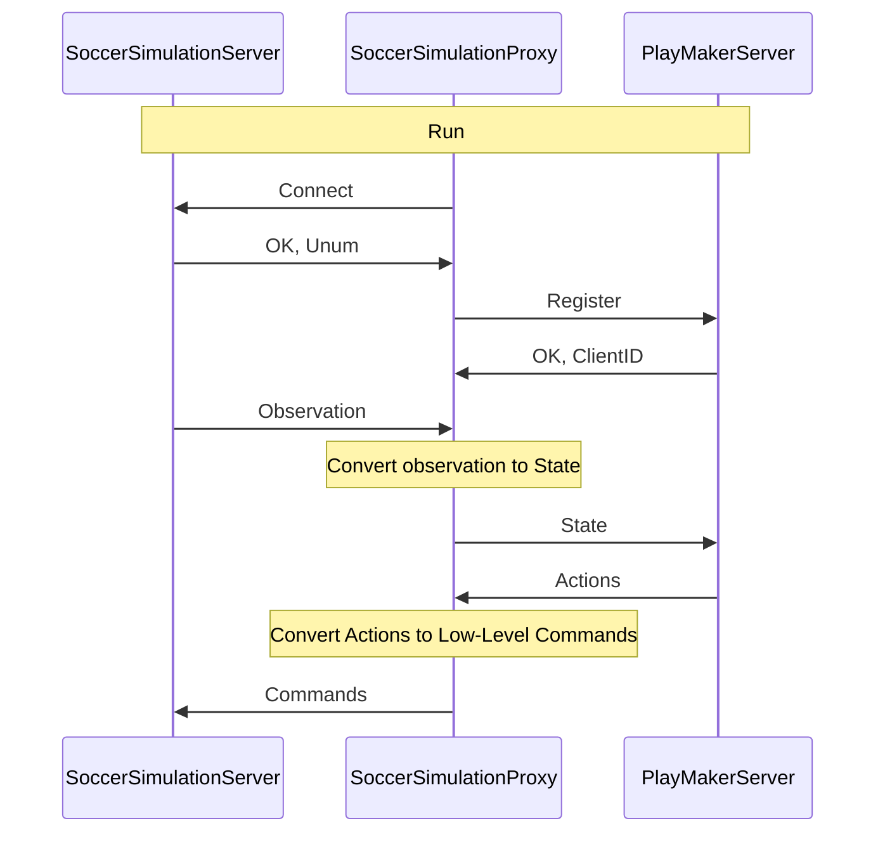

# Soccer Simulation Proxy
[](https://github.com/helios-base/helios-base/blob/master/LISENCE)

Developing a team can be complex due to the environment's intricacy, typically necessitating C++ programming. However, our framework allows for development in other languages by leveraging the [helios-base](https://github.com/helios-base/helios-base) features. By using **SoccerSimulationProxy**, you can develop a team in any language supported by **gRPC** or **Thrift**, such as **C#, C++, Dart, Go, Java, Kotlin, Node.js, Objective-C, PHP, Python, and Ruby**.

To use **gRPC**, you can check out our [gRPC server](../2-sampleserver/0-sample-python-base-code-gRPC/index.md), which is based on proto messages and gRPC services. This server provides a helpful base to get more familiar with the gRPC implementation. 

To use **Thrift**, you can check out our [thrift server](../2-sampleserver/1-sample-python-base-code-thrift/index.md), which is based on proto messages and thrift services. This server provides a helpful base to get more familiar with the thrift implementation.

You can find more information about the services and messages in the [IDL section](../3-idl/protobuf.md).

## Work Flow

This allows you to focus on developing your team's strategy and AI algorithms without worrying about the server's underlying complexity.




If you would like to develop a team or conduct research using **Python**, **C#**, or **JavaScript**, you can check the following links:

- [Playmaker-Server-Python-grpc](../2-sampleserver/0-sample-python-base-code-gRPC/index.md)
- [Playmaker-Server-Python-thrift](../2-sampleserver/1-sample-python-base-code-thrift/index.md)
- [Playmaker-Server-CSharp](https://github.com/CLSFramework/playmaker-server-csharp)
- [Playmaker-Server-NodeJs](https://github.com/CLSFramework/playmaker-server-nodejs)

This new base code is powered by Helios-Base and gRPC, designed to assist researchers in developing a Soccer Simulation 2D team or conducting research in this area. It supports development in any language compatible with gRPC.
## How To Use it?

To use this framework, follow the steps below in order:

### 1 - Start the **rcssserver**
The **rcssserver** hosts the game. You can follow the instructions for setting it up in the [soccersimulation server](./../5-soccersimulation/0-server/index.md).

### 2 - Run the **Playmaker-Server**
Next, run one of the sample Playmaker Servers, such as this [gRPC Server](../2-sampleserver/0-sample-python-base-code-gRPC/index.md), to receive information from the agents and send appropriate actions back to the game.

### 3 - Set up the **Soccer Simulation Proxy**
Now, run the **Soccer Simulation Proxy** to connect to the **rcssserver** and handle information exchange between agents and the server. You can do this using AppImage, Docker, or by building from source. 

Here, we’ll explain how to run the Soccer Simulation Proxy using AppImage and build from the source.

### 4.1 - Use **AppImage**

#### 1. Download the AppImage
 You can download the AppImage from the [release page](https://github.com/CLSFramework/soccer-simulation-proxy/releases) or use the following command to download the latest version:
   ```bash
   wget $(curl -s "https://api.github.com/repos/clsframework/soccer-simulation-proxy/releases/latest" | grep -oP '"browser_download_url": "\K[^"]*' | grep "soccer-simulation-proxy.tar.gz")
   ```
#### 2. Extract the AppImage
After downloading, extract the tar.gz file:
```bash
tar -xvf soccer-simulation-proxy.tar.gz
```
#### 3. Run the Proxy
After downloading, you can run the proxy:
```bash
cd SoccerSimulationProxy
./start.sh
```
If you want to connect the proxy to a grpc server change this parameter to `grpc` in start.sh file.
```bash
rpc_type="thrift"
```
#### 4. Watch the Game
To watch the game, you can use either of the following:

- **[rcssmonitor](https://github.com/rcsoccersim/rcssmonitor)**: A tool to visualize the game.
- **[SoccerWindow2](https://github.com/helios-base/soccerwindow2)**: Another visualization tool for RoboCup Soccer Simulation.

For instructions on how to run **rcssmonitor**, check the [rcssmonitor](../5-soccersimulation/1-monitor/index.md) or [soccer window 2](../5-soccersimulation/2-soccerwindow/index.md).


### 4.2 - Build from **source, install, and run (Linux, WSL)**

To build the soccer simulation proxy, you need to install the following dependencies:

#### 1. LibRCSC

```bash
git clone git@github.com:helios-base/librcsc.git
cd librcsc
git checkout 19175f339dcb5c3f61b56a8c1bff5345109f22ef
mkdir build
cd build
cmake ..
make
make install
```

#### 2. gRPC - follow the instructions provided in the [repository](https://grpc.io/docs/languages/cpp/quickstart/)

```bash
export MY_INSTALL_DIR=$HOME/.local
mkdir -p $MY_INSTALL_DIR
export PATH="$MY_INSTALL_DIR/bin:$PATH"
sudo apt install -y build-essential autoconf libtool pkg-config
git clone --recurse-submodules -b v1.62.0 --depth 1 --shallow-submodules https://github.com/grpc/grpc
cd grpc/
mkdir -p cmake/build
pushd cmake/build
cmake -DgRPC_INSTALL=ON       -DgRPC_BUILD_TESTS=OFF       -DCMAKE_INSTALL_PREFIX=$MY_INSTALL_DIR       ../..
make -j 4
make install
```

then, add the following lines at the end of $HOME/.bashrc

```bash
export MY_INSTALL_DIR=$HOME/.local
export PATH="$MY_INSTALL_DIR/bin:$PATH"
```

then, run the following command

```bash
source $HOME/.bashrc
```

To test grpc, go to grpc directory (in this example it is in $HOME/grpc) and run the following commands:

```bash
cd examples/cpp/helloworld
mkdir -p cmake/build
cd cmake/build/
cmake -DCMAKE_PREFIX_PATH=$MY_INSTALL_DIR ../..
make
run ./greeter_server in one tab
run ./greeter_client in another tab
```

#### 3. SoccerSimulationProxy

```bash
git clone git@github.com:CLSFramework/soccer-simulation-proxy.git
cd soccer-simulation-proxy
mkdir build
cd build
cmake ..
make
```


#### 4. Run Soccer Simulation Proxy

To run the Soccer Simulation Proxy, you can use the following command: (You should run the Soccer Simulation Server and a PlayMaker Server before running the Soccer Simulation Proxy)

```bash
cd build/bin
./start.sh
```

To run the Soccer Simulation Proxy in debug mode, you can use the following command:

```bash
cd build/bin
./start-debug.sh
```

#### 5. Watch the Game
To watch the game, you can use either of the following:

- **[rcssmonitor](https://github.com/rcsoccersim/rcssmonitor)**: A tool to visualize the game.
- **[SoccerWindow2](https://github.com/helios-base/soccerwindow2)**: Another visualization tool for RoboCup Soccer Simulation.

For instructions on how to run **rcssmonitor**, check the [rcssmonitor](../5-soccersimulation/1-monitor/index.md) or [soccer window 2](../5-soccersimulation/2-soccerwindow/index.md).


## References

The paper about HELIOS Base:
- Hidehisa Akiyama, Tomoharu Nakashima, HELIOS Base: An Open Source
Package for the RoboCup Soccer 2D Simulation, In Sven Behnke, Manuela
Veloso, Arnoud Visser, and Rong Xiong editors, RoboCup2013: Robot
World XVII, Lecture Notes in Artificial Intelligence, Springer Verlag,
Berlin, 2014. http://dx.doi.org/10.1007/978-3-662-44468-9_46

# Citation

- [Cross Language Soccer Framework](https://arxiv.org/pdf/2406.05621)
- Zare, N., Sayareh, A., Sadraii, A., Firouzkouhi, A. and Soares, A., 2024. Cross Language Soccer Framework: An Open Source Framework for the RoboCup 2D Soccer Simulation. arXiv preprint arXiv:2406.05621.


