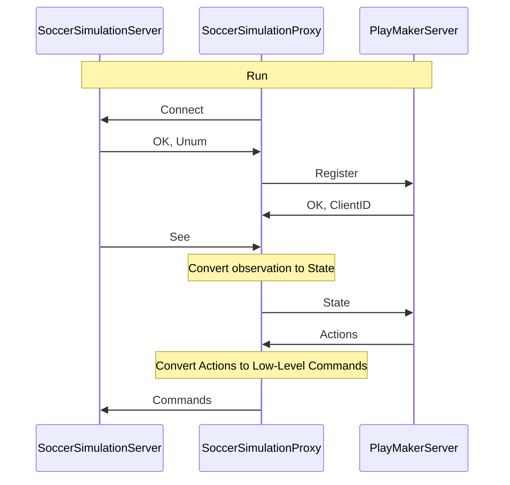

# Soccer Simulation Proxy

RoboCup is an international competition aimed at advancing autonomous robotics and AI through tasks like soccer and rescue. The RoboCup Soccer Simulation 2D league focuses on developing intelligent agents that play soccer in a simulated 2D environment. This league is ideal for testing and developing AI and ML algorithms, including reinforcement learning and multi-agent systems.

Soccer Simulation Proxy is a rpc client (gRPC or Thrift) that bridges the gap between the RoboCup Soccer Simulation 2D server and the PlayMaker Server. It receives information from the server, sends it to the PlayMaker Server, and sends the actions back to the server. This way, you can develop a team in any language supported by gRPC or Thrift, focusing on your team's strategy and AI algorithms without worrying about the server's complexity.

To run a game in the RoboCup Soccer Simulation 2D, you need to operate the rcssserver for hosting games, rcssmonitor to display them, and engage 12 agents (11 players and a coach) per team. Each cycle, agents receive data from the server and must execute actions such as dash and kick. Developing a team can be complex due to the environment's intricacy, typically necessitating C++ programming. However, our framework allows for other languages development, leveraging the helios-base features. By using Soccer Simulation Proxy, you can develop a team in any language supported by `gRPC` or `Thrift`, such as C#, C++, Dart, Go, Java, Kotlin, Node, Objective-C, PHP, Python, and Ruby. You just need to develop a gRPC server based on proto messages or a thrift server based on the thrift file to receive data (state) from the Soccer Simulation Proxy and send actions back to it. This way, you can focus on developing your team's strategy and AI algorithms without worrying about the server's complexity.

You can find more information about the services and messages in the [IDL section](../3-idl/protobuf.md).

## Work Flow

## How To Use it?

The AppImage of soccer simulation proxy is available in the Playmaker server repositories, so you do not need to build it from source or download it directly.

You need to build it from source if you want to modify the code or add new features. To build it from source, you can follow the instructions in the Soccer Simulation Proxy - Build From Source page.

And if you want to develop a new Playmaker Server, you can follow the Soccer Simulation Proxy - Services page to see the services that the Soccer Simulation Proxy provides.
