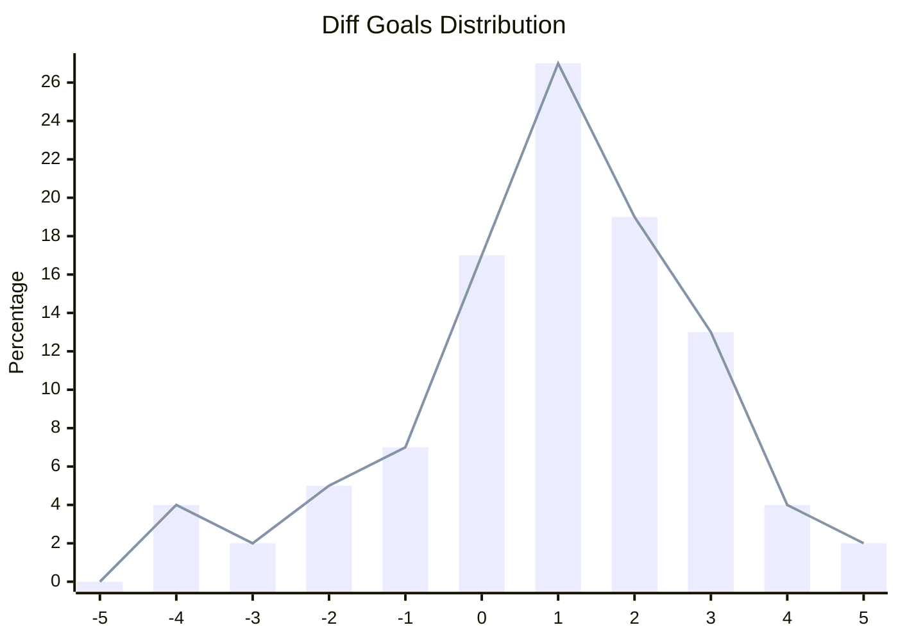
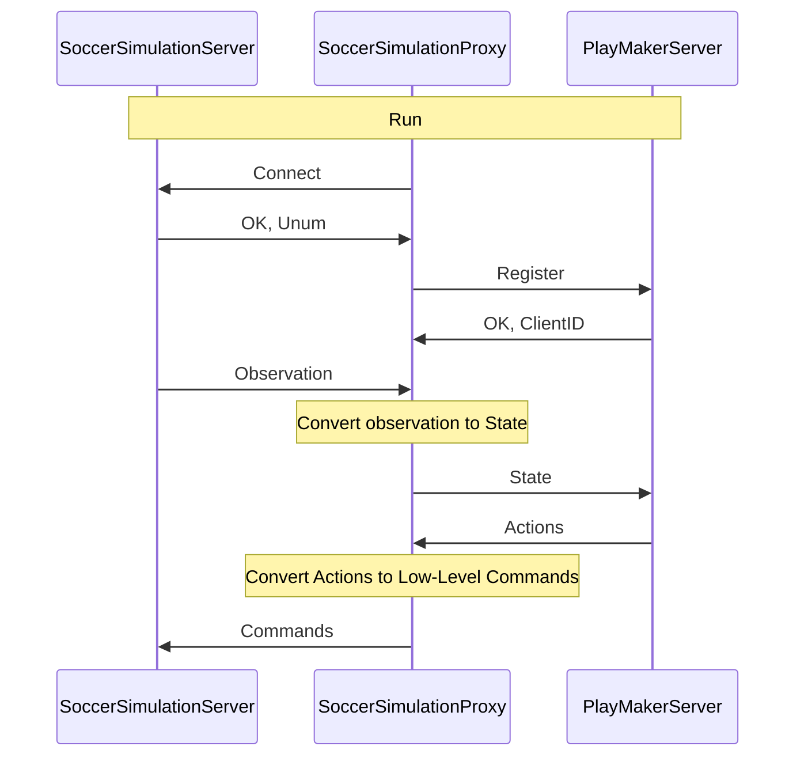

# PY2D Base Code

[](https://clsframework.github.io/docs/introduction/)
[](https://opensource.org/licenses/MIT)


PY2D Soccer Simulation Base Code is a base code for RoboCup 2D Soccer Simulation teams, which is written in Python.
This base code is powered by the [Cross Language Soccer Framework](https://arxiv.org/pdf/2406.05621), which allows you to create a team by using any programming language that supports gRPC or Thrift.
This base code uses `Helios Base` as a proxy to communicate with the RoboCup 2D Soccer Simulation server.
PY2D base is the most power full base code for RoboCup 2D Soccer Simulation which developed in Python.

For more information, please refer to the [documentation](https://clsframework.github.io/).

You can find more information about the services and messages in the [IDL section](https://clsframework.github.io/docs/idl/protobuf).

there are many different ways to run the base code, in the next section, we will explain the easiest way to run the base code.

## Results

### .vs Helios Base

| Summary Statistics

- **Game Count**: 100  
- **Goals**: 234 : 143 (diff: 91)  
- **Points**: 212 : 71 (diff: 141)  
- **Average Goals**: 2.34 : 1.43 (diff: 0.91)  
- **Average Points**: 2.12 : 0.71 (diff: 1.41)  
- **Win**: 65, **Draw**: 17, **Lost**: 18  
- **Win Rate**: 65.00%  
- **Expected Win Rate**: 78.31%  

| Goals Distribution



## Quick start

### Preparation

Install the pre-requisites using the command below:

``` Bash
sudo apt-get install fuse #Used to run AppImages (Proxy, Monitor and RoboCup Server)
```

Clone this repository & install the required python libraries (such as gRPC). Don't forget to activate your virtual environment!

``` Bash
git clone https://github.com/CLSFramework/py2d.git
cd py2d
# Activate venv/anaconda before this step!
pip install -r requirements.txt

./generate.sh # Generate the gRPC files
```

To download RoboCup Soccer 2D Server using the commands below:

``` Bash
pushd scripts
sh download-rcssserver.sh # Download the soccer simulation server
popd
```

Next, download the soccer proxy, which uses C++ to read and pre-processes state data and passes them to the Python server (this project) for decision-making.

``` Bash
pushd scripts
sh download-proxy.sh #install C++ proxy
popd
```

Finally, to watch the game, download the monitor from [the original repository](https://github.com/rcsoccersim/rcssmonitor/releases) in order to view the games.

### Running a game

This section assumes you have download (installed) the server & proxy using the scripts (as mentioned above).

To run a game, you must first run the RoboCup Soccer Server, then your team and opponent team, and finally the monitor.

We must first run a RoboCup Server, in order to host the game:

| Running the RoboCup Soccer Server

``` Bash
cd scripts/rcssserver
./rcssserver
```

| Running your team

We must run the proxy, and rpc server, you can run `start.py` or `start.sh` to run both the proxy and the server.

``` Bash
python3 start.py
// or
./start.sh
```

This script, by default, will run a gRPC server on port 50051, and 12 proxy agents (11 players and 1 coach). In each cycle of the game, the soccer server sends the state of the game to the proxy, which processes the state, creates state message and sends it to the rpc server. The rpc server receives the state message, processes it, and sends the actions to the proxy. The proxy receives the actions, processes them, and sends the commands to the soccer server.

| Running the opponent team

You can download an opponent team binary from the [RoboCup Soccer Simulation Repository](https://archive.robocup.info/Soccer/Simulation/2D/binaries/RoboCup/) for example `CYRUS` team from [here](https://archive.robocup.info/Soccer/Simulation/2D/binaries/RoboCup/2023/Day4/CYRUS_SS2D_RC2023_D4_BIN.tar.gz). After extracting the binary, you can run the team using the command below:

``` Bash
cd CYRUS_SS2D_RC2023_D4_BIN/bin
./start.sh
```

| Running the monitor

To watch the game, you must run the rcssmonitor or soccerwindow2. press <kbd>Ctrl</kbd> + <kbd>C</kbd> to connect to the server, and <kbd>Ctrl</kbd> + <kbd>K</kbd> for kick-off!

### start.py Arguments

| Team and Name Customization

| Argument                  | Short | Description                                                      | Default Value   |
|---------------------------|-------|------------------------------------------------------------------|-----------------|
| `--team_name`             | `-t`  | The name of the team.                                            | `CLS`           |
| `--use-random-name`       |       | Use a randomly generated team name.                              | `False`         |

---

| RPC Server Configuration

| Argument                  | Short | Description                                                      | Default Value   |
|---------------------------|-------|------------------------------------------------------------------|-----------------|
| `--rpc-port`              |       | The port used by the RPC server.                                | `50051`         |
| `--use-random-rpc-port`   |       | Use a randomly assigned port for the RPC server.                | `False`         |
| `--use-different-rpc-port`|       | Use a different port for the RPC server (useful for multi-server setups). By using this option, the script will run a rpc server for each agents| `False`         |
| `--auto-close-rpc-server` |       | Automatically close the RPC server after finishing agent processing. | `False`         |

---

| RoboCup Soccer Server Configuration

| Argument                  | Short | Description                                                      | Default Value   |
|---------------------------|-------|------------------------------------------------------------------|-----------------|
| `--server-host`           |       | The host of the RoboCup Soccer server.                          | `localhost`     |
| `--server-port`           |       | The port of the RoboCup Soccer server.                          | `6000`          |

---

| Agent Proxies

| Argument                  | Short | Description                                                      | Default Value   |
|---------------------------|-------|------------------------------------------------------------------|-----------------|
| `--player`                |       | Run a proxy for a single player agent.                          | `False`         |
| `--coach`                 |       | Run a proxy for a single coach agent.                           | `False`         |
| `--goalie`                |       | Run a proxy for a single goalie agent.                          | `False`         |
| `--debug`                 | `-d`  | Enable debug mode for the agents.                               | `False`         |

---

| Debug and Logging Options

| Argument                  | Short | Description                                                      | Default Value   |
|---------------------------|-------|------------------------------------------------------------------|-----------------|
| `--disable-log-file`      |       | Disable logging to a file.                                      | `False`         |
| `--log-dir`               |       | The directory where logs are stored. If not provided, logs are stored in the default directory with a timestamp. | `None`          |

---

### CLSF Tutorial Video (English)

[](https://www.youtube.com/watch?v=hH-5rkhiQHg)

### CLSF Tutorial Video (Persian)

[](https://www.youtube.com/watch?v=97YDEumcVWU&t=0s)

## Why & How it works

Originally the RoboCup 2D Soccer Simulation teams used C++, as the main code base (Agent2D aka Helios Base) was written in this language due to its performance.
Due to the popularity of python in Machine Learning & AI spaces we decided to create a python platform which would be equivalent to Agent 2D.
However, using python alone was too slow as preprocessing sensor information & tasks such as localization took too long.

For this reason we have split up the code into two segments:
The data processing section in proxy, which creates a World Model (state), and passes it to python for planning to occur. This repository uses gRPC to pass along the World Model, but there is a sister-repo which is compatible with thrift.



As seen in the figure, the proxy handles connecting to the server, receiving sensor information and creating a world-model, and finds the action to take via a remote procedure call to a decision-making server, which is this repository.

## Other Solutions To Run The Base Code

### Running the base code with different rpc port

In soccer simulation 2D games (official competitions), each agents (players and coach) should be run in a separate process. So, you need to connect each agent to a rpc server (each agent has a separate rpc server). In this case, you need to run the rpc server for each agent separately. You can use the following commands to run the rpc server for each agent for debugging purposes.

| Note: For official competitions, tournament script will run each player/coach with separate command, so it will be like the next section, but the result will be the same as this section because the rpc server will be run for each agent separately.

``` Bash
python3 start.py --use-different-rpc-port
// or
./start.sh --use-different-rpc-port
```

### Running each agent and server separately

In soccer simulation 2D games (official competitions), each agents (players and coach) should be run in a separate process. So, you need to connect each agent to a rpc server (each agent has a separate rpc server). You can use the following commands to run each agent and rpc server separately.

``` Bash
python3 start.py --goalie
python3 start.py --player (you need to run this command 11 times)
python3 start.py --coach
// or
./start.sh --goalie
./start.sh --player (you need to run this command 11 times)
./start.sh --coach
```

### Running the rpc server and proxy separately

To run the rpc server and proxy separately, you can use the following commands.

``` Bash
python3 server.py
cd scripts/proxy
./start.sh --rpc-type=grpc
```

## Create Binary

As you know python is an interpreted language and it is slow in comparison to C++. In official tournaments, an agent should send actions to the server in less than 100ms. Also, python may not be installed on the tournament server. So, you need to create a binary from your python code. You can use the following commands to create a binary from your python code.

``` Bash
cd scripts
./create_binary.sh
```

After creating the binary, you can find it in the `scripts/binary` directory. In this directory, you can find the following files and directories:

- `start.bin`: The binary file that behaves like the `start.py` script. So, by running this file, you can run one rpc server and 12 proxy agents (11 players and 1 coach).
- `start`: The tournament script will run this file to run your team in the tournament. This file will run one agent and one rpc server on random port.
- `startAll`: This script is available for testing purposes. By running this file, it will call the `start` file 12 times to run 12 agents and 12 rpc servers.
- `scripts`: This directory contains the necessary files to run the proxy.
- `src`: This directory contains the formations of your team.

## How to debug your team

There are three different solution for debugging your team:

### Logging

You can use the logging module to log the information in rpc server code. By default, the logs are stored in the `logs` directory. For example, `agentX_Y.log` is the log file for the agent with unum `X` and `Y` is the unique id of the agent in rpc server (This one is not important for you). `proxy.log` is the log file for the proxy for all agents. `start-team.log` is the log file for the `start.py` script.

### Debug Mode

If you enable the debug mode, the proxy agents will be run in debug mode, so you can check graphical logs in `soccerwindow2` application. You can use `message Log` or `message DebugClient` to send the debug information to the proxy and then proxy will save them in file or send them directly to the `soccerwindow2` application to show them in the graphical interface. For more information, you can check the [IDL section in the documentation](https://clsframework.github.io/docs/idl/protobuf).

## Test Performance by using AutoTest

TODO

## How to improve the performance of the team

TODO

## Documentation

TODO

## Citation

- [Cross Language Soccer Framework](https://arxiv.org/pdf/2406.05621)
- Zare, N., Sayareh, A., Sadraii, A., Firouzkouhi, A. and Soares, A., 2024. Cross Language Soccer Framework: An Open Source Framework for the RoboCup 2D Soccer Simulation. arXiv preprint arXiv:2406.05621.
