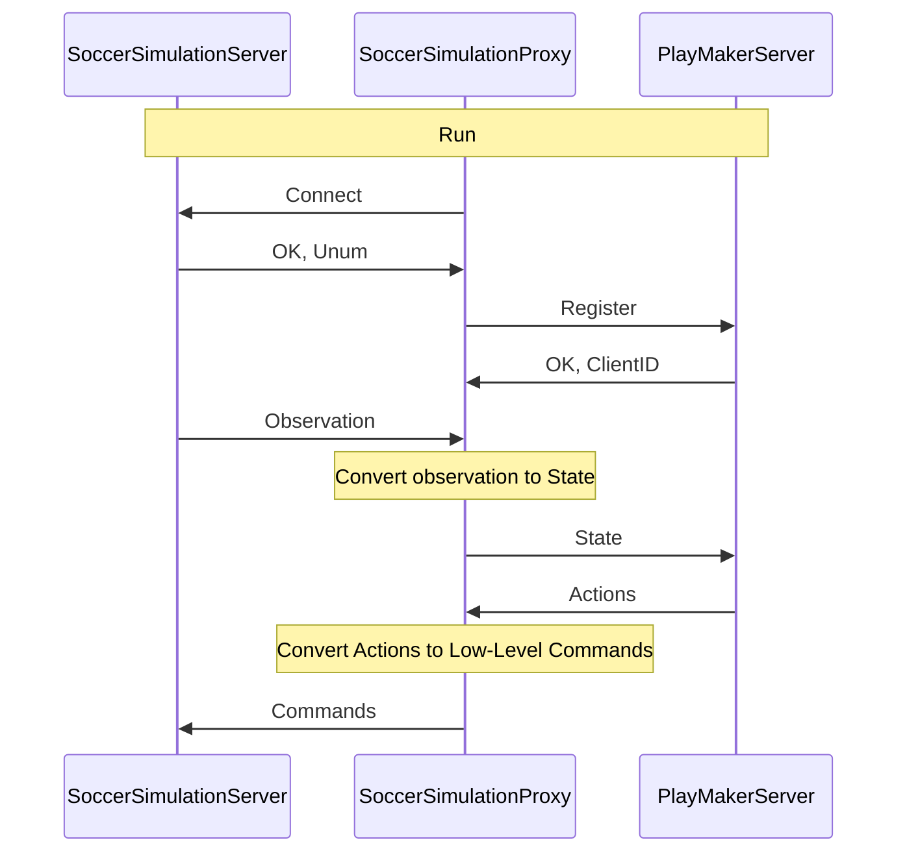

# PY2D Base Code

[](https://clsframework.github.io/docs/introduction/)
[](https://opensource.org/licenses/MIT)


PY2D Soccer Simulation Base Code is a base code for RoboCup 2D Soccer Simulation teams, which is written in Python.
This base code is powered by the [Cross Language Soccer Framework](https://arxiv.org/pdf/2406.05621), which allows you to create a team by using any programming language that supports gRPC or Thrift.
This base code uses `Helios Base` as a proxy to communicate with the RoboCup 2D Soccer Simulation server.
PY2D base is the most power full base code for RoboCup 2D Soccer Simulation which developed in Python.

For more information, please refer to the [documentation](https://clsframework.github.io/).

You can find more information about the services and messages in the [IDL section](../../3-idl/protobuf.md).

there are many different ways to run the base code, in the next section, we will explain the easiest way to run the base code.

## Quick start

### Preparation

Install the pre-requisites using the command below:

``` Bash
sudo apt-get install fuse #Used to run AppImages (Proxy, Monitor and RoboCup Server)
```

Clone this repository & install the required python libraries (such as gRPC). Don't forget to activate your virtual environment!

``` Bash
git clone https://github.com/CLSFramework/py2d.git
cd py2d
# Activate venv/anaconda before this step!
pip install -r requirements.txt

./generate.sh # Generate the gRPC files
```

To download RoboCup Soccer 2D Server using the commands below:

``` Bash
pushd scripts
sh download-rcssserver.sh # Download the soccer simulation server
popd
```

Next, download the soccer proxy, which uses C++ to read and pre-processes state data and passes them to the Python server (this project) for decision-making.

``` Bash
pushd scripts
sh download-proxy.sh #install C++ proxy
popd
```

Finally, to watch the game, download the monitor from [the original repository](https://github.com/rcsoccersim/rcssmonitor/releases) in order to view the games.

### Running a game

This section assumes you have installed the server & proxy using the scripts (as mentioned above).

To run a game, you must first run the RoboCup Soccer Server, then your team and opponent team, and finally the monitor.

We must first run a RoboCup Server, in order to host the game:

| Running the RoboCup Soccer Server

``` Bash
cd scripts/rcssserver
./rcssserver
```

| Running your team

We must run the proxy, and rpc server, you can run `start.py` or `start.sh` to run both the proxy and the server.

``` Bash
python3 start.py
// or
./start.sh
```

This script, by default, will run a gRPC server on port 50051, and 12 proxy agents (11 players and 1 coach). In each cycle of the game, the soccer server sends the state of the game to the proxy, which processes the state, creates state message and sends it to the rpc server. The rpc server receives the state message, processes it, and sends the actions to the proxy. The proxy receives the actions, processes them, and sends the commands to the soccer server.

| Running the opponent team

You can download an opponent team binary from the [RoboCup Soccer Simulation Repository](https://archive.robocup.info/Soccer/Simulation/2D/binaries/RoboCup/) for example `CYRUS` team from [here](https://archive.robocup.info/Soccer/Simulation/2D/binaries/RoboCup/2023/Day4/CYRUS_SS2D_RC2023_D4_BIN.tar.gz). After extracting the binary, you can run the team using the command below:

``` Bash
cd CYRUS_SS2D_RC2023_D4_BIN/bin
./start.sh
```

| Running the monitor

To watch the game, you must run the rcssmonitor or soccerwindow2. press <kbd>Ctrl</kbd> + <kbd>C</kbd> to connect to the server, and <kbd>Ctrl</kbd> + <kbd>K</kbd> for kick-off!

### start.py Arguments

##### Team and Name Customization

| Argument                  | Short | Description                                                      | Default Value   |
|---------------------------|-------|------------------------------------------------------------------|-----------------|
| `--team_name`             | `-t`  | The name of the team.                                            | `CLS`           |
| `--use-random-name`       |       | Use a randomly generated team name.                              | `False`         |

---

##### RPC Server Configuration

| Argument                  | Short | Description                                                      | Default Value   |
|---------------------------|-------|------------------------------------------------------------------|-----------------|
| `--rpc-port`              |       | The port used by the RPC server.                                | `50051`         |
| `--use-random-rpc-port`   |       | Use a randomly assigned port for the RPC server.                | `False`         |
| `--use-different-rpc-port`|       | Use a different port for the RPC server (useful for multi-server setups). By using this option, the script will run a rpc server for each agents| `False`         |
| `--auto-close-rpc-server` |       | Automatically close the RPC server after finishing agent processing. | `False`         |

---

##### RoboCup Soccer Server Configuration

| Argument                  | Short | Description                                                      | Default Value   |
|---------------------------|-------|------------------------------------------------------------------|-----------------|
| `--server-host`           |       | The host of the RoboCup Soccer server.                          | `localhost`     |
| `--server-port`           |       | The port of the RoboCup Soccer server.                          | `6000`          |

---

##### Agent Proxies

| Argument                  | Short | Description                                                      | Default Value   |
|---------------------------|-------|------------------------------------------------------------------|-----------------|
| `--player`                |       | Run a proxy for a single player agent.                          | `False`         |
| `--coach`                 |       | Run a proxy for a single coach agent.                           | `False`         |
| `--goalie`                |       | Run a proxy for a single goalie agent.                          | `False`         |
| `--debug`                 | `-d`  | Enable debug mode for the agents.                               | `False`         |

---

##### Debug and Logging Options

| Argument                  | Short | Description                                                      | Default Value   |
|---------------------------|-------|------------------------------------------------------------------|-----------------|
| `--disable-log-file`      |       | Disable logging to a file.                                      | `False`         |
| `--log-dir`               |       | The directory where logs are stored. If not provided, logs are stored in the default directory with a timestamp. | `None`          |

---

### CLSF Tutorial Video (English)

[](https://www.youtube.com/watch?v=hH-5rkhiQHg)

### CLSF Tutorial Video (Persian)

[](https://www.youtube.com/watch?v=97YDEumcVWU&t=0s)

## Why & How it works

Originally the RoboCup 2D Soccer Simulation teams used C++, as the main code base (Agent2D aka Helios Base) was written in this language due to its performance.
Due to the popularity of python in Machine Learning & AI spaces we decided to create a python platform which would be equivalent to Agent 2D.
However, using python alone was too slow as preprocessing sensor information & tasks such as localization took too long.

For this reason we have split up the code into two segments:
The data processing section in proxy, which creates a World Model (state), and passes it to python for planning to occur. This repository uses gRPC to pass along the World Model, but there is a sister-repo which is compatible with thrift.



As seen in the figure, the proxy handles connecting to the server, receiving sensor information and creating a world-model, and finds the action to take via a remote procedure call to a decision-making server, which is this repository.

## Other Solutions To Run The Base Code

TODO

## Create Binary

TODO

## Test Performance by using AutoTest

TODO

## How to improve the performance of the team

TODO

## Documentation

TODO

## Citation

- [Cross Language Soccer Framework](https://arxiv.org/pdf/2406.05621)
- Zare, N., Sayareh, A., Sadraii, A., Firouzkouhi, A. and Soares, A., 2024. Cross Language Soccer Framework: An Open Source Framework for the RoboCup 2D Soccer Simulation. arXiv preprint arXiv:2406.05621.
